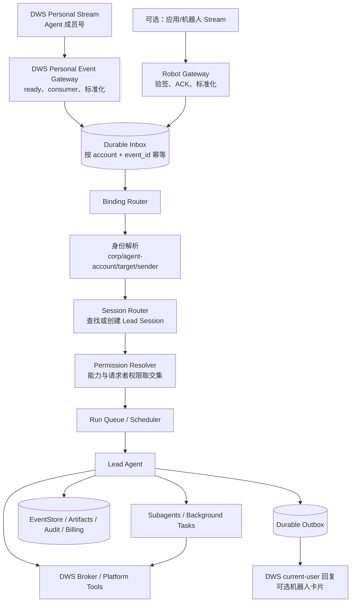

# TASK-38：Claude Tag 式组织协作 Agent 模块方案

> 状态：架构研究稿，可进入实施拆分
>
> 任务：TASK-38 · Claude Tag 能力实现
>
> 结论基线：采用用户已完成的 Claude Tag 产品核验，不把未公开实现细节写成事实。

## 1. 结论先行

这个能力值得做，但不应在产品里叫「Claude Tag」。建议模块名为 **组织协作 Agent**，钉钉入口叫 **Agent 频道**。

它不是新增一个“群机器人”，而是把以下对象正式纳入组织治理：

```text
组织拥有的 Agent
├─ 可版本化的身份、提示语与能力
├─ 一个或多个钉钉通道账号
├─ 面向群、员工、部门的通道绑定
├─ 每项工作独立的持久 Session
├─ 共享记忆、私密记忆与上下文装配
├─ 请求者权限、组织凭证与审批策略
├─ Lead / Subagent 执行编排
├─ 预算、审计、质检与结果证据
└─ 主动任务、事件触发与消息投递
```

当前仓库已经具备大部分昂贵的运行时底座：公司级专职 Agent、版本化治理资源、持久 Session/Run/Event、子 Agent、钉钉收发、DWS、Credential、审计、计费、目录组和质检。真正缺的不是 Agent loop，而是把这些能力收束成 **组织身份 + 通道绑定 + 多参与者 Session + 权限交集** 的统一产品模型。

最重要的四个设计判断：

1. **默认通信身份改为 Agent 专属钉钉成员账号。** 它是组织通讯录中的独立成员，拥有自己的名称、头像、群关系、DWS OAuth、消息记录和数据权限；不借用任何真实员工账号。企业内部应用/机器人只作为能力缺口的补充通道，不再是默认主体。
2. **DWS 消息事件与 DWS 业务工具要分成两个运行边界。** DWS 个人事件流可以成为 Agent 成员号的消息入口和回复出口；日历、通讯录、审批、文档、待办等操作仍经受控 DWS Broker 执行。不能让模型直接托管 token 或长连接进程。
3. **配置不应直接长在 Session 上。** 管理员配置的是 Agent 版本和通道绑定版本；Session 创建时固定快照。否则同一会话会随后台修改静默漂移，无法审计和复现。
4. **共享 Agent 不等于共享全部权限。** 默认执行权限必须是：

```text
实际可执行权限
= 平台与租户已开放能力
∩ Agent / Runtime Profile 能力范围
∩ 通道绑定策略
∩ 当前请求者本人的数据权限
∩ 本次选用凭证的授权范围
∩ 当前动作的审批规则
```

群成员身份只能决定“能否向 Agent 发起请求”，不能自动授予数据权限。

### 1.1 身份方案修正：Agent 专属成员号可以成为主通道

用户本轮澄清后，原方案中“企业内部应用/机器人身份作为 Channel Account”的默认设计需要修正。更符合产品目标的身份模型是：

```text
组织创建 Agent 专属钉钉成员账号
    ↓ 一次性登录并完成 DWS OAuth / PAT 授权
DWS Personal Stream 监听该账号未来消息
    ↓ event_id 去重，conversation_id / message_id 路由
平台创建或续接独立 Lead Session
    ↓ Agent 执行、审批、Worker、审计
DWS 以 current-user 身份回复群或私聊
```

截至 2026-08-13，已从当前 DWS 二进制和官方仓库确认：

| 能力 | 结论 | 已核实入口 |
|---|---|---|
| 创建独立组织账号 | 支持创建“企业专属账号”，名称和登录号必填，手机号可选 | `dws contact account create` |
| 群内被 `@` 的实时事件 | 支持 | `user_im_message_receive_at` |
| 全部私聊消息实时事件 | 支持 | `user_im_message_receive_o2o_all` |
| 指定群/全部群消息实时事件 | 支持 | `user_im_message_receive_group` / `user_im_message_receive_group_all` |
| 事件稳定路由字段 | 支持 | `event_id`、`conversation_id`、`message_id`、`sender_open_dingtalk_id` |
| 以该成员身份发群消息/私聊 | 支持 | `dws chat +messages-send --as user` |
| 以该成员身份引用回复 | 支持 | `dws chat +messages-reply` |
| 多账号 profile | 支持 | `corpId + userId` 唯一标识，可显式 `--profile` |

当前平台内置的是 DWS `v1.0.55`，已具备底层 `event consume` 和 user 身份发送；官方 `v1.0.58` 进一步提供 `dws event +listen-im --kind at-me|all-direct|group` 的高层入口。版本差异不阻断验证，但正式模块必须 pin 并回归测试指定版本。

需要准确区分两件事：

- **DWS 能产出消息事件并以成员身份回复；**
- **DWS 不会自动创建本产品的 Session。**

平台仍需实现常驻 `DwsPersonalEventGateway`：等待事件流 ready、持续读取 NDJSON、写 durable inbox、按 Binding 和引用消息路由 Session、管理进程退出与订阅恢复，再通过 outbox 调 DWS 回复。`Skill` 只是 Agent 使用 DWS 业务能力的说明，不承担消息网关职责。

这条路线目前是**技术上成立、产品集成尚未完成**：当前仓库的 `DingtalkChannel` 仍只接机器人 Stream/Webhook，DWS 连接也仍按真实用户 workspace 建模；当前平台 DWS overlay 还明确禁止复用“无人小号”。因此不能把 Agent 账号塞进现有“我的钉钉连接”冒充完成，必须新增第一类 `agent_dws_member` 身份、独立凭证托管和运维策略。

尚需用真实企业账号做 P0 验证的事项：

1. “企业专属账号”能否完整完成 DWS Device OAuth 和个人事件订阅；
2. 当前企业是否已开通 DWS 个人事件能力及所需管理员白名单；
3. 长连接重连、订阅清理、token/PAT 长期保活的稳定性；
4. 流式卡片、卡片回调、文件/语音等体验是否全部支持 current-user 身份；
5. Agent 成员账号的席位、登录、离职/停用和审计口径。

如果上述验证有能力缺口，再为具体缺口增加企业内部应用/机器人辅助通道；不要一开始就把机器人重新设为产品主体。

官方与运行时证据：

- [DWS 官方个人 IM 事件 Skill](https://github.com/DingTalk-Real-AI/dingtalk-workspace-cli/blob/main/skills/multi/dingtalk-event/SKILL.md)
- [DWS 事件到 current-user Chat 的精确字段映射](https://github.com/DingTalk-Real-AI/dingtalk-workspace-cli/blob/main/skills/multi/dingtalk-event/references/event-im-output.md)
- [DWS 官方 README：用户/机器人消息能力与认证](https://github.com/DingTalk-Real-AI/dingtalk-workspace-cli/blob/main/README_zh.md)
- [DWS v1.0.58 变更记录](https://github.com/DingTalk-Real-AI/dingtalk-workspace-cli/blob/main/CHANGELOG.md)
- [钉钉开放平台：创建用户](https://open.dingtalk.com/document/development/user-information-creation)
- 本地事实源：`dws --version`、`dws event consume --help`、`dws event list --category im --mock`、`dws chat +messages-send --help`、`dws contact account create --help`

---

## 2. 目标与非目标

### 2.1 目标

组织管理员能够：

1. 在组织管理中创建或关联一个 Agent 专属钉钉成员账号，并完成 DWS 授权；
2. 创建或选择一个组织 Agent，将该成员账号设为 Agent 的钉钉身份；
3. 把 Agent 绑定到指定钉钉群、员工、部门或目录组；
4. 为绑定配置触发方式、提示语补充、上下文、Skill、工具、连接器、记忆、权限、审批和预算；
5. 在钉钉中获得可持续、可并行、可审计的 Agent 协作体验；
6. 在管理后台查看 Session、参与者、配置快照、执行轨迹、审批、用量和结果证据。

### 2.2 非目标

首期不做：

- 常驻一个永不结束的 LLM 进程监听群聊；
- 自动读取群全部历史并声称拥有“完整上下文”；
- 让群成员通过 Agent 的组织 service account 绕过本人权限；
- 为每个群复制一套 Agent 定义；
- 把 Agent DWS token、机器人密钥或第三方凭证暴露给模型或 Sandbox；
- 把现有真实员工的“我的 DWS 授权”直接改绑给组织 Agent；
- 仅靠提示语门禁承担数据授权。

---

## 3. 现有能力盘点

### 3.1 可以直接复用

| 能力 | 当前事实 | 本模块中的用途 |
|---|---|---|
| 公司级专职 Agent | 已有名称、提示语、Skill、知识、受众、门禁和启停 | 迁移为组织 Agent 的兼容入口 |
| Managed Agent | 已有 `org_agent/personal_agent/template`、不可变版本和 revision | 作为 Agent 身份与定义的正式事实源 |
| Assignment | 已支持 everyone/user/directory_group/agent 的 allow/deny | 控制谁可以使用 Agent、Skill、Credential、Connector |
| Runtime Profile | 已支持上下文、Skill、MCP、Memory、模型、工具、能力、执行目标和版本 pin | 作为可复用的执行配置档 |
| Durable Session/Run | Session meta、PG 投影、Run 状态、lease、EventStore 已存在 | 承载 Lead Session 与恢复 |
| Subagent/Background | 独立 child session、父子链、用量、工具过滤和后台任务已存在 | 执行复杂任务和并行 Worker |
| 钉钉机器人通道 | 已有 Stream/Webhook、立即 ACK、消息去重、私聊/群聊、AI 卡片和主动发送 | 作为兼容/补充通道，不再作为默认 Agent 身份 |
| DWS | 已有个人 device OAuth、多账号 profile、个人 IM 事件、current-user 消息发送、守活和断开 | 同时提供 Agent 成员号消息适配器和受控钉钉业务能力 |
| 治理与运营 | Credential、Run 快照、审计、Billing、成员预算、QA、门禁统计 | 作为权限、追责、成本和质量底座 |

关键代码证据：

- 组织 Agent 定义：`server/src/data/orgAgents/types.ts:93`
- 组织 Agent Skill 与知识：`server/src/data/orgAgents/types.ts:109`
- Managed Agent 不可变版本：`server/src/data/agentResources/types.ts:1`
- Assignment 主体类型：`server/src/data/assignments/types.ts:4`
- Runtime Profile 完整能力面：`server/src/data/agentProfiles/types.ts:16`
- Session 绑定 `orgAgentId`：`server/src/runtime/sessionCatalog.ts:14`
- Run 资源解析快照：`server/src/runtime/runResolutionSnapshotStore.ts:21`
- 子 Agent 独立 child session：`server/src/runtime/subagent/subagentRunner.ts:220`
- 钉钉 Stream ACK 与去重：`server/src/channels/dingtalk/protocol/streamClient.ts:124`
- 钉钉群/私聊目标：`server/src/channels/dingtalk/pipeline/preprocessor.ts:130`
- 当前 DWS 多账号 profile 元数据：`server/src/dws/store.ts:13`
- DWS 个人事件：当前二进制 `dws event consume --help` / `dws event list --category im --mock`
- DWS 成员身份发送：当前二进制 `dws chat +messages-send --help`
- 成员预算：`server/src/data/billing/types.ts:151`
- 专职 Agent 质检入口：`server/src/routes/orgQa.ts:198`

### 3.2 当前结构性缺口

#### 缺口 A：没有组织可管理的 Agent 钉钉成员账号

当前通信身份只有服务配置中的机器人 `appKey/appSecret`，启动时统一注册；组织管理员无法创建/关联 Agent 专属成员、完成 DWS 授权、启动个人事件流、查看健康状态或停用。见：

- `server/src/app/config.ts:110`
- `server/src/app/runtime.ts:3040`
- `server/src/channels/dingtalk/channel.ts:133`

DWS CLI 已具备成员账号事件和发送能力，但仓库没有 `AgentDwsAccount`、个人事件 consumer supervisor、durable inbox/outbox 或 Agent 账号级 profile 账本。

#### 缺口 B：钉钉只把 `conversationId` 映射为一个 Agent Session

当前映射结构是：

```text
conversationId → agentSessionId
```

且保存于 `dingtalk-sessions.json`。见：

- `server/src/data/sessions/types.ts:3`
- `server/src/data/sessions/dingtalkSessionStore.ts:89`

这会把一个群中的所有任务串进同一个 Session，既污染上下文，也形成单 Session 锁和单队列。

#### 缺口 C：钉钉入口没有解析组织 Agent 绑定

Web 入口会从 Session meta 或请求解析 `orgAgentId`，执行存在、启用、租户和 Assignment 校验；钉钉预处理目前只构造普通 `InboundMessage` 和请求者用户，没有 `orgAgentId/bindingId`。见：

- Web 校验：`server/src/channels/web/channel.ts:2585`
- 钉钉预处理：`server/src/channels/dingtalk/pipeline/preprocessor.ts:82`

因此当前钉钉会话本质仍是“某个员工的个人 Agent 经钉钉入口运行”。

#### 缺口 D：共享 Session 仍按单一 owner 建模

`SessionParticipants` 只有 owner 和 owner 的个人 Agent；Session record 也只有一个 `userId/username`。见：

- `shared/src/types/session.ts:13`
- `server/src/runtime/sessionCatalog.ts:14`

共享群聊至少需要区分：Agent 所有者、当前请求者、参与者、审批人和观察者。

#### 缺口 E：Org Agent 的 workspace 和记忆仍跟请求者走

当前 workspace 默认由用户身份派生；组织 Agent 会跳过个人 persona、个人 memory 和 MemorySearch。见：

- 用户型 workspace identity：`server/src/runtime/workspaceIdentity.ts:17`
- Org Agent 关闭个人记忆：`server/src/runtime/rawRuntimeRunDispatch.ts:1702`

所以现状既没有组织 Agent 自己的持久 workspace，也没有可配置的“组织/群/私聊/任务”分层记忆。

#### 缺口 F：DWS 当前只建模真实用户，没有 Agent-owned account

DWS connection 主键包含 `tenantId + userId + profileId`，token 位于该真实用户 workspace 的 `.dws/`。见：

- DWS identity：`server/src/dws/store.ts:27`
- 用户 workspace 登录：`server/src/dws/authFlow.ts:65`
- profile 的 `corpId` 解析：`server/src/dws/keepalive.ts:256`

这可以支撑“按请求者本人权限执行”，但不能直接表达“组织创建并交给某个 Agent 的独立成员账号”。应新增 `principal_type=agent` 与稳定 `agentId`，把 token 放入 Agent credential workspace/Broker；不能伪造一个平台用户来复用现有记录。

#### 缺口 G：钉钉没有审批/追问交互面

Runtime 已有 `permission_request`、`ask_user` 和 durable interaction；钉钉消费者目前只处理文本、思考、工具、压缩和错误，没有审批或问题卡片处理。见：

- 交互事件类型：`server/src/types/index.ts:40`
- 钉钉事件消费者：`server/src/channels/dingtalk/pipeline/eventStreamConsumer.ts:78`

高风险写操作如果没有钉钉内审批，就谈不上“丝滑”，只能失败或要求用户回 Web。

#### 缺口 H：Legacy OrgAgent 与治理资源双轨

仓库同时存在文件型 `OrgAgentStore` 与 PG `ManagedAgentResource/Version/Assignment`；部分 Legacy 写入口已经可被迁移门禁封闭。前后端共享类型还没有同步服务端新增的 knowledge、department、role 和 guardrail mode 字段。见：

- Legacy file store：`server/src/data/orgAgents/store.ts:61`
- Managed Agent：`server/src/data/agentResources/types.ts:4`
- Legacy 写门禁：`server/src/routes/orgAgents.ts:152`
- 前端共享旧类型：`shared/src/types/orgAgent.ts:9`

本模块不能继续只扩展 JSON OrgAgent，否则绑定、凭证、版本、审计和多实例运行会再次分裂。

---

## 4. 产品对象模型

建议把产品对象明确成五层，而不是让“一个 Session 配一切”。

### 4.1 组织 Agent（Managed Agent）

组织拥有的长期产品主体：

- 身份：名称、头像、说明；
- 定义：系统提示语、示例问题；
- 能力：Skill、知识、MCP、工具、模型、执行目标；
- 行为：记忆策略、子 Agent、后台任务、排程；
- 治理：受众、门禁、预算、审批默认值；
- 版本：每次发布生成不可变 `agentVersionId`。

正式事实源使用现有 `ManagedAgentResource + ManagedAgentVersion + Assignment`。Legacy `OrgAgentRecord` 只保留兼容投影，逐步停止新增字段。

### 4.2 Agent 钉钉账号（Agent DingTalk Account）

它代表组织在钉钉通讯录中为 Agent 创建的独立成员，不等于任何真实员工的 DWS 登录：

```text
Agent DingTalk Account
├─ corpId
├─ dingtalkUserId / openDingTalkId
├─ 企业专属 loginId（不保存密码）
├─ DWS profileId + OAuth credentialRef
├─ Personal Stream 订阅与 consumer 状态
├─ 群关系、私聊范围和目录状态
├─ PAT scope / 授权状态
└─ 保活、停用和审计信息
```

账号与组织 Agent 默认一对一，使钉钉中的头像、名称、消息记录和审计主体都稳定对应一个 Agent。后续若明确需要节省账号席位，可以支持一账号多 Agent，但必须由显式命令/Binding 路由，不能让同一个成员身份在同一群里人格漂移。

保留 `account_kind=internal_app_robot` 作为兼容模式，仅承接普通成员账号暂不支持的消息形态、卡片回调或外部场景。界面与审计必须明确显示实际发送身份，不能用机器人代发却让用户误以为是成员账号。

### 4.3 通道绑定（Agent Channel Binding）

绑定是 Agent 与具体沟通对象之间的配置边界：

```text
Agent + Agent DingTalk Account + Target → Binding
```

Target 支持：

- `group`：钉钉群；
- `user`：内部员工私聊；
- `directory_group`：部门/目录组，展开为员工私聊范围；
- 后续可扩展 `department`、`role`。

Binding 配置：

- 触发方式：仅 `@`、私聊全部、关键词、卡片回调；
- Session 策略：私聊连续、每次新任务、群任务卡；
- Binding 补充提示语；
- Runtime Profile；
- Skill/工具/连接器的进一步收窄；
- 记忆可见范围；
- Credential 策略；
- 审批策略；
- 预算和频率限制；
- 启停、版本和健康状态。

Binding 只允许**收窄** Agent 能力，不能给 Agent 增加其本身没有的能力。

### 4.4 工作 Session（Lead Session）

Session 是一项工作的持久协作对象，不是配置容器。创建时固定：

- `agentId + agentVersionId`；
- `bindingId + bindingRevision`；
- `runtimeProfileVersionId`；
- 目标群/员工；
- Agent principal；
- 初始请求者和参与者；
- workspace 与 memory scope；
- 权限/凭证/模型/Skill 的解析快照。

现有 Session/EventStore/RunStore 继续使用，但要扩展组织主体与多参与者字段。

### 4.5 Worker Session

复杂任务由 Lead 使用现有 `Agent` 工具派生：

- 独立 child session；
- 独立上下文和事件；
- 继承 Lead 的 Agent、Binding、请求者权限快照和 workspace scope；
- 只能获得父 Agent 已有能力的子集；
- 返回结构化 outcome、artifact、verification 和 evidence refs；
- 最终由 Lead 验收并回复原钉钉任务卡。

---

## 5. 推荐总体架构



### 5.1 控制面

负责“配置和治理”：

- Managed Agent 与版本；
- Agent DingTalk Account（DWS 成员号）与可选机器人补充通道；
- Binding 与版本；
- Assignment；
- Credential；
- Runtime Profile；
- 审批、预算和目录同步；
- Session 管理、QA 和审计。

### 5.2 事件面

负责“消息可靠进入和可靠送达”：

- DWS Personal Stream consumer 必须等待 ready，持续读取 NDJSON，并由 supervisor 负责优雅退出、重连和订阅恢复；
- 可选机器人事件继续立即 ACK；
- 两类原始事件统一标准化后写 durable inbox；
- Worker 异步路由和执行；
- 回复先写 outbox，再由 DWS current-user 或明确的补充机器人通道投递；
- 重试不重复创建 Run、不重复发送结果。

当前机器人 Stream 已有 ACK 和进程内去重，但 `await onMessage()` 仍直接进入执行链；当前 DWS 只有授权/保活，没有个人事件 consumer。首期应新增统一 durable inbox/outbox，而不是把 DWS stdout 直接接到现有 dispatch。

### 5.3 执行面

负责“Agent 真正干活”：

- Session/Run/EventStore 是事实源；
- Brain 按事件唤醒，不常驻；
- Sandbox 可重建，组织 workspace 持久；
- Lead 可自己执行，也可按需派 Worker；
- Runtime 每个模型轮和工具调用都重新检查仍然有效的硬权限。

---

## 6. 数据模型建议

### 6.1 新增 `channel_accounts`

```text
channel_account_id
 tenant_id
 channel_type               // dingtalk
 account_kind               // agent_dws_member / internal_app_robot
 agent_id                   // agent_dws_member 默认必填且一对一
 display_name
 corp_id
 external_principal_id      // dingtalkUserId/openDingTalkId 或 appKey/robotCode
 login_id                   // 企业专属登录号；只展示脱敏值
 dws_profile_id             // agent_dws_member 使用
 credential_id              // OAuth token 或 app secret 的 GovernanceCredential 引用
 event_mode                 // personal_stream / app_stream / webhook
 subscription_state_json
 pat_scope_state_json
 status                     // draft / authorizing / active / degraded / disabled / revoked
 health_json
 revision
 created_by / updated_by
 created_at / updated_at
```

约束：

- `(tenant_id, channel_type, corp_id, external_principal_id)` 唯一；
- Agent 成员号 OAuth/PAT、机器人 Secret 都只经 Credential Broker 解析；
- password、access token、refresh token 不进入数据库普通列、prompt、日志或 workspace；
- 停用账号立即停止新事件执行，历史 Session 保留只读；
- Agent 成员号属于组织并归属 Agent，不属于任何真实员工；
- 当前 `runtime_dws_connections(tenantId,userId,profileId)` 不能直接复用，需支持 typed principal。

### 6.2 新增 `agent_channel_bindings`

```text
binding_id
 tenant_id
 agent_id
 agent_version_policy       // latest_for_new_session / fixed
 fixed_agent_version_id
 channel_account_id
 target_type                // group / user / directory_group
 external_target_id
 target_display_name
 trigger_policy_json
 session_policy_json
 context_policy_json
 capability_overrides_json  // 仅收窄
 credential_policy_json
 approval_policy_json
 budget_policy_json
 status
 revision
 created_by / updated_by
 created_at / updated_at
```

约束：

- 同一目标如果绑定多个 Agent，必须有不同成员账号、明确 `@` 对象或关键词路由，禁止无规则竞争；
- Binding 更新只影响新 Session；已存在 Session 继续使用 pinned revision；
- 紧急停用、Credential 撤销、租户停用是硬状态，立即影响全部 Session。

### 6.3 新增 `channel_event_inbox`

```text
inbox_event_id
 tenant_id
 channel_account_id
 external_event_id
 event_type
 conversation_id
 external_message_id
 sender_external_id
 normalized_payload_json
 status                    // received / routed / processed / failed / dead_letter
 attempt_count
 received_at / processed_at
```

唯一键建议：

```text
(channel_account_id, external_event_id)
```

DWS 个人事件优先使用稳定 `event_id`；只有补充通道确实未提供稳定事件 ID 时，才退化使用规范化字段摘要，并把算法版本写入 payload，避免未来碰撞口径不可追溯。

### 6.4 新增 `channel_message_routes`

解决钉钉没有 Slack `thread_ts` 的任务归属问题：

```text
channel_account_id
 conversation_id
 external_message_id       // 用户消息、Agent 回复或卡片 outTrackId
 binding_id
 session_id
 run_id
 direction                 // inbound / outbound
 created_at
```

用户回复某条 Agent 消息、点击任务卡或携带 Session 编号时，可精确回到原 Session。

### 6.5 新增 `channel_outbox`

```text
outbox_id
 tenant_id
 channel_account_id
 session_id
 run_id
 target_json
 payload_json
 idempotency_key
 status                    // pending / sending / sent / failed / dead_letter
 attempt_count
 next_attempt_at
 external_receipt_json
 created_at / sent_at
```

最终答复、审批卡、追问卡和主动提醒都走 outbox，避免 Run 已完成但钉钉消息丢失。

### 6.6 扩展 Session meta / PG 投影

建议新增：

```text
agentId
agentVersionId
bindingId
bindingRevision
channelAccountId
conversationId
workItemId
workspaceOwnerType         // user / agent
workspaceOwnerId
memoryScopeId
initiatorUserId
participantUserIds
```

不要只在 `meta_json` 里无限堆字段。高频过滤字段 `agent_id/binding_id/channel_account_id/conversation_id` 应进入 PG 投影实体列并建立租户前缀索引；完整快照仍可保留 JSONB。

### 6.7 扩展 Run Resolution Snapshot

现有快照已经记录 agent、Skill、Connector、Credential、Environment、Memory 和 Model。新增：

- `binding`；
- `channelAccount`；
- `requester`；
- `credentialMode`；
- `approvalPolicyVersion`；
- `budgetPolicyVersion`；
- `sessionConfigDigest`。

这样每个 Run 都能回答：谁在什么群里，通过哪个 Agent、哪版配置、哪份凭证、按什么权限执行了什么。

---

## 7. Session 路由规则

### 7.1 私聊

默认键：

```text
(bindingId, employeeUserId, activeConversationSlot)
```

默认行为：

- 同一员工与同一 Agent 续接当前私聊 Session；
- 用户发送“新任务/新对话”时归档当前 Session 并创建新 Session；
- 管理员可把 Binding 配成“每次消息新 Session”，但不建议作为默认；
- 私聊记忆只能进入该员工与该 Agent 的私密 scope，不得写入群共享记忆。

### 7.2 群聊

**不能继续采用 `conversationId → 单 Session`。** 推荐规则：

1. 回复某条 Agent 消息或操作某张任务卡：按 `channel_message_routes` 回原 Session；
2. 携带明确 Session/任务编号：回对应 Session；
3. 新的 `@Agent` 顶层请求：创建新的 Lead Session；
4. 普通群消息默认不触发，除非 Binding 明确开启 ambient monitor；
5. 不使用“最近几分钟都算同一个任务”作为主路由，时间窗只能是低置信度兜底。

Agent 回复至少应以成员账号身份携带：

- 任务标题；
- Session 短编号；
- 当前状态；
- 负责人/请求者。

P0-A 若确认 current-user 流式卡片与回调可用，再增加“继续补充、批准、拒绝、停止、查看结果”等动作；若必须使用补充应用通道，界面要明确该动作卡由应用发送，普通对话仍由 Agent 成员号发送。

这样同一个群里的任务 A/B/C 是三个 Lead Session，可并行运行；同一任务内部仍由 Session lock 保证决策顺序。

### 7.3 并发消息

- 同一 Session 的新消息进入现有 durable steering/interjection 队列；
- 不同 Session 独立排队和执行；
- Agent 执行期间的新群消息只有在精确路由命中 Session 时才成为插话；
- 无法确定归属时创建新任务或发澄清卡，不能静默塞进最近 Session。

---

## 8. 上下文与记忆

### 8.1 上下文装配

每次唤醒使用：

```text
平台系统提示语
+ 租户指令/公司信息
+ pinned Agent Version
+ pinned Binding Revision
+ 当前请求者与通道元数据
+ Session 滚动摘要
+ 最近原始消息
+ 相关记忆/企业事实召回
+ 正在运行的任务注册表
+ 必要的外部系统状态
```

不追求把整个群历史塞进模型。

### 8.2 五层记忆

| 层级 | 内容 | 可见范围 |
|---|---|---|
| 组织记忆 | 公司公共事实、制度、术语 | 该组织内被授权 Agent |
| Agent 记忆 | Agent 的长期工作经验和稳定知识 | 该 Agent 的所有绑定 |
| Binding 记忆 | 某个群/部门的决策、术语、持续事项 | 该 Binding 下 Session |
| Session 记忆 | 当前任务摘要、决策、产物和状态 | 当前 Session 参与者 |
| 私密记忆 | 员工私聊中的个人上下文 | 员工本人 + 授权 Agent |

`Binding 记忆` 与 `私密记忆` 必须物理/逻辑隔离。私聊内容不能因为同一个 Agent 也在群里就被群 Session 搜到。

### 8.3 Workspace

新增 Agent principal 的稳定 workspace identity，例如：

```text
ws_<tenantId>__agent_<agentId>
```

建议目录语义：

```text
agent workspace
├─ shared/          // Agent 组织级长期资产
├─ bindings/<id>/   // 群/员工绑定资产
├─ sessions/<id>/   // 任务产物与临时状态
└─ memory/          // 按 scope 管控的记忆
```

Sandbox 仍按顶层 Session 隔离和重建，父 Session 与子 Agent 共享同一 Session sandbox scope；持久文件落 Agent workspace。请求者个人文件只通过显式授权工具读取，不把用户整个 workspace 直接挂给共享 Agent。

---

## 9. 权限与凭证模型

### 9.1 三种主体必须分开

```text
Agent principal     谁在工作、拥有 workspace/记忆/产物
Requester principal 当前哪位员工提出请求、数据权限属于谁
Channel principal   哪个 Agent 钉钉成员号或补充应用负责收发消息
```

当前 `ChannelContext.user/sessionOwner` 主要用于“管理员代操作个人会话”，语义不足。建议新增显式字段：

```text
channelContext.requester
channelContext.agentPrincipal
channelContext.channelPrincipal
channelContext.participants
```

逐步替换不同代码路径中对 `user ?? sessionOwner` 和 `sessionOwner ?? user` 的不一致选择。

### 9.2 Credential 模式

Binding 对每个 Connector 指定一种模式：

| 模式 | 说明 | 默认用途 |
|---|---|---|
| `requester_delegated` | 使用当前请求者自己的 OAuth/DWS profile | 查询请求者个人日程、待办和本人可见数据 |
| `agent_dws_member` | 使用 Agent 专属钉钉成员 OAuth | 以 Agent 身份收发消息、管理 Agent 自有日程/待办、访问明确授予 Agent 的资源 |
| `org_service` | 使用组织共享 service credential | 公共系统集成、明确授权的组织动作、补充机器人能力 |
| `agent_owned` | Agent 的其他专属服务账号 | 独立邮箱、仓库、工单账号等 |
| `none` | 禁止该 Connector | 默认拒绝 |

规则：

- `requester_delegated` 找不到授权时，向请求者发授权卡，不得回退 `agent_dws_member` 或 `org_service`；
- `agent_dws_member` 可以直接操作 Agent 自有对象和明确授权给 Agent 的资源；请求者借 Agent 访问其他业务数据时仍需请求者权限交集或显式业务授权；
- `org_service` 必须有显式 Assignment、scope、purpose 和审批策略；
- 凭证撤销、过期、停用立即生效，不受 Session pin 保护；
- Secret 由 Broker 注入到受控调用，不进入 prompt、事件、日志、Run snapshot 或 Agent workspace。

### 9.3 DWS 消息适配器与业务 Broker

DWS 首期应拆成两个平台服务，不能让模型在 Shell 中自行启动监听或接触 token：

```text
DwsPersonalEventGateway
- 绑定 Agent DWS profile
- 托管 event consumer 生命周期
- 解析 NDJSON、去重并写 inbox
- 通过 outbox 以 current-user 身份回复

DWS Skill + DwsToolBroker
- 告诉 Agent 何时调用业务能力
- 选择 agent_dws_member / requester_delegated profile
- 校验 scope、审批、执行并保存证据
```

事件入口在当前 `v1.0.55` 可使用：

```bash
dws event consume user_im_message_receive_at \
  --flatten -f ndjson --profile <corpId:userId>

dws event consume user_im_message_receive_o2o_all \
  --flatten -f ndjson --profile <corpId:userId>
```

升级到官方 `v1.0.58` 后可优先使用 `event +listen-im` 高层入口，但底层事件键仍是事实源。宿主必须等待 `[event] ready`，优雅终止 consumer，处理订阅复用/清理和重连；不能靠轮询聊天记录模拟实时事件。

推荐工具调用上下文：

```json
{
  "tenantId": "tenant-a",
  "requesterUserId": "user-1",
  "agentId": "agent-sales",
  "bindingId": "bind-group-9",
  "sessionId": "session-123",
  "credentialMode": "agent_dws_member",
  "dwsProfileId": "corp-id:agent-user-id"
}
```

Broker 负责：

1. 解析 Connector/Skill 是否允许；
2. 根据动作语义选择 Agent 自有 profile 或请求者 profile，禁止静默降级；
3. 校验操作 scope、资源归属和请求者权限交集；
4. 判断是否需要 PAT 或业务审批；
5. 执行 DWS；
6. 保存结构化回执与证据；
7. 对写操作做写后回读验证。

当前平台 DWS overlay 的“每个 workspace 绑定本人账号、禁止无人小号”对现有个人连接器仍然正确；本模块不能绕过它，而应新增单独的 Agent credential 类型、管理员接入流程和审计规则，再有意识地扩展该策略。

### 9.4 审批

审批策略按动作而不是按整个工具粗放配置：

- 查询状态：通常允许；
- 创建个人待办：可由请求者预授权；
- 向群发消息、给他人建待办、提交审批：需要请求者或业务负责人确认；
- 删除、批量修改、外部发送：强审批；
- Agent 账号操作自己的日程、待办、消息和明确授权给 Agent 的资源：可按 Agent 自有权限执行；
- Agent 账号访问非 Agent 自有业务数据，而请求者本人无权：默认拒绝，不允许仅靠一次“同意”扩权。

钉钉内使用互动卡片承接 durable interaction：

```text
待确认：将报价单发送到客户群
[查看依据] [批准] [拒绝]
```

卡片回调写入现有 interaction/approval 状态，再由 Scheduler 唤醒原 Run。

---

## 10. DWS 与钉钉通道的明确分工

| 场景 | 组件 |
|---|---|
| Agent 成员号收到群 `@` / 私聊 | `DwsPersonalEventGateway` |
| 可选机器人消息事件 | 现有 `DingtalkChannel` / Robot Gateway |
| consumer、验签/ACK、幂等、Session 路由 | Gateway + Inbox + Binding Router |
| 成员身份回复、引用回复 | DWS current-user Chat + Outbox |
| 流式卡片、任务卡、审批卡 | 优先验证 DWS current-user Card；缺口才使用明确的补充应用通道 |
| 查询通讯录/群/日历/文档/审批/待办 | DWS Broker / DWS Skill |
| 管理后台创建 Agent 企业专属账号 | 确定性 Account Provisioning Service，可封装 DWS/OpenAPI，不经模型 |
| 管理后台选择群和员工 | 确定性目录同步服务；可复用 DirectoryGroup 投影 |
| Agent 主动发工作通知/群消息 | Agent DWS profile；越权业务动作仍走权限交集和审批 |

不建议让管理后台“调用一次 Agent + DWS Skill”来创建账号或加载群列表。管理端账号和目录是控制面，应通过确定性的服务封装 DWS/OpenAPI；Skill 是模型运行时能力，不是后台 CRUD 数据源。

---

## 11. 管理界面方案

### 11.1 组织管理新增「Agent 钉钉账号」

主流程：

1. 选择组织 Agent；
2. 创建企业专属成员账号，或关联已准备好的专属成员账号；
3. 由管理员/账号托管人完成一次 DWS Device OAuth 和必要 PAT 授权；
4. 验证 `@` 事件、私聊事件和 current-user 回复；
5. 将账号加入群并创建 Binding。

页面展示：

- corp、Agent 成员名称、头像、loginId 脱敏值、DWS profile；
- OAuth/PAT、Personal Stream、consumer、最近事件和回复健康状态；
- 同步群/员工/部门；
- 重新授权、暂停、断开、停用成员；
- 可选的应用/机器人补充通道及其真实用途。

现有个人「能力中心 → 钉钉连接」继续标注为 **我的 DWS 授权**；新增入口标注为 **组织 Agent 账号**。两者使用不同 principal、workspace、Credential 和审批策略，不能互相改绑。

### 11.2 组织 Agent 编辑器改为六个页签

1. **身份**：名称、头像、公开说明、示例问题；
2. **职责**：内部提示语、门禁、知识；
3. **能力**：Runtime Profile、Skill、MCP、工具、模型、子 Agent；
4. **成员**：成员、目录组、部门、角色 Assignment；
5. **沟通**：钉钉账号、群/员工 Binding、触发和 Session 策略；
6. **治理**：记忆、Credential、审批、预算、审计和质检。

现有 OrgAgent 表单的身份、提示语、Skill、成员和门禁 UI 可拆分复用；Runtime Profile 的“有效配置摘要”可直接用于展示能力交集。

### 11.3 Binding 配置抽屉

每个群/员工一条绑定：

```text
目标：销售一部群
触发：仅 @Agent
Session：每个新 @ 创建任务；回复任务卡续接
上下文：组织 + Agent + 本群记忆
能力：继承 Agent，禁用 Shell 和公开 Web
DWS：默认 Agent 成员账号；个人数据按动作切换请求者授权
写操作：群消息/他人待办需批准
预算：每月 N 积分；单任务上限 M
状态：启用
```

界面必须实时显示“最终有效能力”，不是只显示配置值：

```text
平台开放 ∩ 租户开放 ∩ Agent ∩ Binding ∩ 请求者/凭证
```

### 11.4 Session 控制台

管理员或授权质检人员可以：

- 按 Agent、Binding、群、员工、状态筛选；
- 查看参与者和当前请求者；
- 查看 Agent/Binding/Profile 版本快照；
- 查看 Lead/Worker 树；
- 查看工具、审批、用量、结果证据；
- 暂停、终止、归档；
- 对敏感内容继续复用现有临时 `ContentAccessGrant`，不能因组织管理员身份默认无限读取。

---

## 12. API 草案

### 12.1 Agent DingTalk Account

```text
GET    /api/governance/channel-accounts?type=dingtalk
POST   /api/governance/channel-accounts/dingtalk/member/create
POST   /api/governance/channel-accounts/dingtalk/member/link
POST   /api/governance/channel-accounts/dingtalk/app          // 可选补充通道
GET    /api/governance/channel-accounts/:id
PATCH  /api/governance/channel-accounts/:id
POST   /api/governance/channel-accounts/:id/authorize-dws
POST   /api/governance/channel-accounts/:id/verify-events
POST   /api/governance/channel-accounts/:id/sync-directory
POST   /api/governance/channel-accounts/:id/reauthorize
POST   /api/governance/channel-accounts/:id/pause
DELETE /api/governance/channel-accounts/:id
```

`member/create` 是管理员级写操作，先展示名称、loginId、部门和席位影响并确认；创建成功后仍需完成该 Agent 账号的 DWS OAuth，不能把创建者的 token 复制给它。`DELETE` 默认只删除本产品绑定并停 consumer；是否同时停用钉钉成员必须是独立的强确认动作。

### 12.2 Binding

```text
GET    /api/governance/agents/:agentId/channel-bindings
POST   /api/governance/agents/:agentId/channel-bindings
GET    /api/governance/channel-bindings/:bindingId
PATCH  /api/governance/channel-bindings/:bindingId
POST   /api/governance/channel-bindings/:bindingId/test
POST   /api/governance/channel-bindings/:bindingId/pause
DELETE /api/governance/channel-bindings/:bindingId
```

所有写 API：

- 使用 expected revision/CAS；
- 先写 intent audit，终态审计 fail-closed；
- Secret 只能提交到 credential 专用入口；
- 普通响应不返回 secretRef；
- 平台管理员跨租户操作仍需显式 tenant scope。

### 12.3 Session/Interaction

```text
GET  /api/org-agent-sessions
GET  /api/org-agent-sessions/:sessionId
POST /api/org-agent-sessions/:sessionId/stop
POST /api/org-agent-sessions/:sessionId/archive
POST /api/channel-interactions/:interactionId/resolve
```

钉钉卡片回调使用单独签名入口，内部落到同一 durable interaction service，不能直接调用 runtime 私有对象。

---

## 13. 配置继承与变更规则

### 13.1 配置继承

```text
Platform Controls
  ↓ 收窄
Tenant Entitlements / Policies
  ↓ 收窄
Managed Agent Version
  ↓ 收窄
Runtime Profile Version
  ↓ 收窄
Channel Binding Revision
  ↓ 结合
Requester / Credential / Approval
  = Effective Run Snapshot
```

任何下层都不能扩张上层能力。

### 13.2 版本更新

- 新 Session 默认使用最新已发布 Agent Version 和 Binding Revision；
- 已有 Session 继续使用 pinned config，保证可复现；
- 管理员可执行“迁移现有 Session”，生成显式 migration event；
- Agent/Binding/Channel Account 紧急停用立即阻止新 Run；
- Credential 撤销、租户停用、用户离职立即生效；
- Skill/Connector 被平台撤回时立即从有效集消失，并在 Run snapshot 标记 unavailable，不能为保持复现而继续越权。

---

## 14. 实施分期

### P0-A：Agent 成员账号技术验证

1. 创建一个测试“企业专属账号”，分配到独立的数字员工部门；
2. 用该账号完成 DWS Device OAuth 和最小 PAT 授权；
3. 将其加入测试群，由另一员工 `@`，验证 `user_im_message_receive_at`；
4. 私聊该账号，验证 `user_im_message_receive_o2o_all`；
5. 用 `--as user` 完成群回复、私聊、引用回复和幂等发送；
6. 验证 consumer 重连、服务重启、token 刷新、停用账号后的 fail-closed；
7. 分别验证 Markdown、文件、流式卡片和卡片回调，记录必须使用应用/机器人的缺口。

**完成标准**：拿到一条真实的“消息 → event_id → Session stub → 成员身份回复”闭环和能力缺口矩阵；任一关键能力仅存在于文档而未实测，不进入 P1。

### P0-B：统一事实源与身份语义

1. 定义 typed `ManagedAgentDefinition`，覆盖现有 OrgAgent 字段；
2. 把 Legacy OrgAgent 变成 Managed Agent/Assignment 的兼容投影；
3. 在 Session/Run 中显式区分 Agent、Requester、Channel principal；
4. 为 Agent 建立组织级 workspace identity；
5. 扩展 Run snapshot，固定 agent/binding/requester 配置；
6. 扩展 DWS connection principal，区分 `user` 与 `agent`，不伪造平台用户。

**完成标准**：Web 端现有组织 Agent 行为不回退，但运行事实源不再依赖新增 JSON 字段，Agent DWS credential 有独立所有权。

### P1：Agent 钉钉账号、Binding 与可靠消息链

1. `channel_accounts + credentialRef`，实现 `agent_dws_member`；
2. 组织后台创建/关联、授权、验证、停用 Agent 钉钉账号；
3. `DwsPersonalEventGateway` consumer supervisor；
4. `agent_channel_bindings` 与群/员工选择；
5. durable inbox/outbox；
6. DWS 事件解析 binding，创建组织 Agent Lead Session；
7. 私聊连续 Session、群内新任务 Session、引用回复路由；
8. 任务卡展示状态和 Session 编号；P0-A 证实的缺口才接补充机器人通道。

**完成标准**：两个群、两个员工都能与同一 Agent 产生互相隔离的 Session；同群两个任务可并行，钉钉中显示的发送者是 Agent 成员账号。

### P2：DWS 权限交集与钉钉内审批

1. DWS Broker/Tool Provider；
2. agent-dws-member、requester-delegated 与 org-service 三种凭证模式；
3. 按动作 scope 与审批策略；
4. 钉钉授权卡、追问卡、审批卡；
5. 写后回读与结构化证据；
6. Credential 撤销和离职即时失效。

**完成标准**：Agent 可按自身身份操作自有对象和明确授权资源；没有权限的群成员无法借 Agent 成员账号读取或修改其他业务数据；授权用户可在钉钉内完成问答、审批和续跑。

### P3：共享记忆、主动工作与运营闭环

1. Agent/Binding/Session/Private memory scope；
2. 滚动摘要和相关历史召回；
3. Routines、事件触发、频道监控；
4. Agent/Binding 预算；
5. Session 控制台、Lead/Worker trace、QA 和效果指标；
6. 配置灰度、评测和批量迁移。

**完成标准**：Agent 可跨休眠持续工作，但不会把私聊记忆泄露到群，也不会因上下文无限增长失控。

---

## 15. 第一批实施切片建议

如果下一步直接进入代码，建议把首批 PR 控制在以下边界：

```text
Spike-0：Agent 企业专属账号 + DWS Personal Stream 真实闭环
PR-A：Typed Agent principal + Session snapshot
PR-B：Agent DWS Account + OAuth/PAT Credential 管理
PR-C：DWS Personal Event Gateway + consumer supervisor
PR-D：Agent Channel Binding CRUD + 管理 UI
PR-E：Durable Inbox/Outbox + DingTalk Binding Router
PR-F：群/私聊 Session 路由 + 成员身份回复/任务卡
PR-G：DWS Agent/Requester Broker + 钉钉 Interaction
```

不要把这些切片压进一个 PR。它们有清楚的依赖顺序，但每块都应能独立迁移、测试和回滚；Spike-0 未通过时，先拿真实缺口做身份方案决策，不直接退回“机器人就是 Agent”。

---

## 16. 端到端验收场景

1. 组织管理员创建或关联 Agent 专属钉钉成员账号，完成其独立 DWS OAuth；token、login secret 不出现在 API 响应、日志和 Run snapshot；
2. 钉钉中可见的发送者是“销售 Agent”成员账号，不是创建者、其他员工或伪装机器人；
3. 管理员将“销售 Agent”绑定到群 A、群 B、员工甲和员工乙；
4. 群 A 与群 B 的记忆、Session 和产物互不可见；
5. 群 A 同时发起任务 1 和任务 2，产生两个 Lead Session，并行执行；
6. 用户引用回复任务 1 消息或点击任务卡，只进入任务 1，不污染任务 2；
7. 未绑定平台账号的钉钉成员被明确拒绝或引导绑定，不匿名执行；
8. Agent 可查询自己的日程/待办和明确授权给 Agent 的资源；员工甲的个人数据仍使用员工甲 DWS profile，员工乙不能看到；
9. 普通群成员无法借 Agent 成员账号操作本人无权且未明确授权给 Agent 的仓库、审批或文档；
10. 写操作在钉钉卡片批准后续跑，拒绝后留下完整终态；
11. 重复 `event_id` 不会创建重复 Run，投递重试不会重复发送最终答复；
12. Personal Stream 重连、服务重启、Sandbox 重建后 Session 能继续，未推送文件仍在 Agent workspace；
13. Agent/Binding 配置更新后，旧 Session 仍能显示自己 pinned 的版本；
14. Agent 或 Agent DingTalk Account 停用后，新消息立即 fail-closed，历史 Session 可审计；
15. 管理员能看到 Agent→Lead→Worker 树、工具、审批、用量和证据；
16. 私聊记忆无法从群 Session 的 MemorySearch 召回。

---

## 17. 主要风险与禁止走法

### 17.1 最高风险：把 channel membership 当 permission

这是必须从架构层堵死的错误。群成员可见 Agent，不代表他拥有 Agent 连接器背后的数据权限。

### 17.2 不要把 DWS Skill 当安全边界

Skill 是使用说明和流程知识，不能证明请求者有权限。真正授权必须由 Broker、Credential scope 和业务系统权限完成。

### 17.3 不要复用现有“我的 DWS 授权”托管 Agent

现有连接器按真实平台用户和个人 workspace 建模，平台 overlay 也明确禁止无人小号。Agent 成员号必须是新的 typed principal、Credential 和运维路径；否则账号归属、授权人、离职、审计和 token 生命周期都会失真。

### 17.4 DWS 个人事件仍处于开放能力验证期

官方 DWS 已提供个人 IM 事件，但项目处于共创阶段，企业需要管理员授权，具体租户是否开放、长期配额和稳定性没有足够独立证据。P0-A 必须以真实账号实测，不把 CLI help 等同于生产可用性。

### 17.5 独立成员身份不自动解决越权

Agent 成员账号拥有自己的权限是优点，也可能成为固定的权限放大器。必须明确区分“Agent 自有对象/显式授予 Agent 的资源”和“请求者借 Agent 访问其他业务数据”；后者继续执行权限交集与审批。

### 17.6 不要延续 `conversationId → 单 Session`

它只适合最早期个人机器人，会造成群任务串行、上下文污染、记忆泄漏和审计归属不清。

### 17.7 不要让每个 Session 自由修改能力

Session 可以记录临时任务上下文，但提示语、Skill、工具、Credential 和权限策略必须来自版本化配置；临时例外要走审批和 event，不做不可追踪的 inline patch。

### 17.8 不要把组织 Credential 放进 Agent workspace

Agent 执行 workspace 可以持久，但持久不等于可信。DWS 因 CLI 约束需要持久化 token 时，只能放在 Broker/Gateway 控制的 credential workspace；模型可见的 Agent workspace 与 Sandbox 永远拿不到真实 secret。

### 17.9 不要优先做“全群自动监听”

先把明确 `@`、私聊、任务卡和权限模型做稳。Ambient monitor 会同时放大成本、隐私、噪音和误触发，应该在 P3 作为显式 opt-in 能力。

---

## 18. 最终建议

这不是一个独立小插件，而应该成为现有“组织智能体”的 **沟通与协作模块**：

```text
组织智能体（身份与能力）
  + Agent 钉钉成员账号（独立组织身份与权限）
  + DWS Personal Event Gateway（群 @ / 私聊入口）
  + 通道绑定（群/员工/部门）
  + Lead Session（工作对象）
  + Worker（执行并行）
  + 权限/凭证/审批（治理）
  + DWS Broker（Agent 自有能力 + 请求者委托能力）
  + 可选应用/机器人补充通道（只补能力缺口）
```

优先级判断：

1. 先用真实企业专属账号跑通 DWS 消息闭环，确认产品前提；
2. 再统一 Agent 主体、DWS principal 和权限主体；
3. 实现 Agent 账号、Personal Event Gateway、Binding 与可靠消息链；
4. 接 Agent/requester 双凭证模式和钉钉内审批；
5. 最后做共享记忆、主动监控和组织级运营。

独立成员账号比默认机器人更符合“组织里的数字员工”：它有可见身份、自己的聊天关系和独立权限。真正壁垒仍不是头像像不像员工，而是把这个身份做成可治理的 Agent principal，并确保它不会成为群成员借道扩权的万能账号。

---

## 19. 2026-08-14 实施状态

当前分支已经落地基础聊天闭环：

- Agent typed DWS principal、独立模型 workspace 与独立 connector credential workspace；
- Agent DWS Account、OAuth、Personal Stream supervisor；
- governance schema v20 durable inbox、conversation binding、lease/fencing、重试与死信；
- `event_id` 幂等、同会话顺序门禁、稳定 Session 与确定性 Runtime run id；
- 组织 Agent dispatch、崩溃后从 EventStore 恢复最终文本；
- DWS current-user 引用回复和 `--uuid` 幂等，超过 24 小时窗口不盲目重发。

本轮实现的 Binding 粒度仍是 `account + conversation → Session`，足以验证私聊与群 `@` 的基础连续会话，但**尚未完成**方案中更高阶的群任务/thread 拆分、Requester 平台成员绑定与权限交集、钉钉内审批/AskUserQuestion 卡片、文件和流式卡片回复。真实钉钉账号 OAuth、PAT 与 Personal Stream 仍必须在发布后用测试账号实测，不能用单元测试代替。
