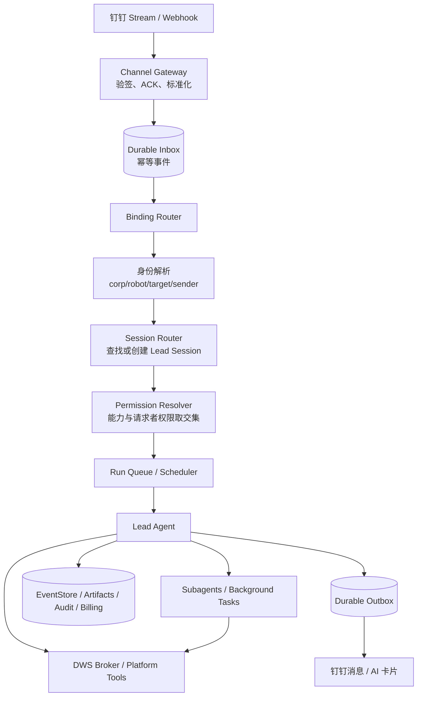

# TASK-38：Claude Tag 式组织协作 Agent 模块方案

> 状态：架构研究稿，可进入实施拆分
>
> 任务：TASK-38 · Claude Tag 能力实现
>
> 结论基线：采用用户已完成的 Claude Tag 产品核验，不把未公开实现细节写成事实。

## 1. 结论先行

这个能力值得做，但不应在产品里叫「Claude Tag」。建议模块名为 **组织协作 Agent**，钉钉入口叫 **Agent 频道**。

它不是新增一个“群机器人”，而是把以下对象正式纳入组织治理：

```text
组织拥有的 Agent
├─ 可版本化的身份、提示语与能力
├─ 一个或多个钉钉通道账号
├─ 面向群、员工、部门的通道绑定
├─ 每项工作独立的持久 Session
├─ 共享记忆、私密记忆与上下文装配
├─ 请求者权限、组织凭证与审批策略
├─ Lead / Subagent 执行编排
├─ 预算、审计、质检与结果证据
└─ 主动任务、事件触发与消息投递
```

当前仓库已经具备大部分昂贵的运行时底座：公司级专职 Agent、版本化治理资源、持久 Session/Run/Event、子 Agent、钉钉收发、DWS、Credential、审计、计费、目录组和质检。真正缺的不是 Agent loop，而是把这些能力收束成 **组织身份 + 通道绑定 + 多参与者 Session + 权限交集** 的统一产品模型。

最重要的三个设计判断：

1. **钉钉聊天通道与 DWS 执行能力必须分层。** `DingtalkChannel` 负责及时收发消息；DWS 负责日历、通讯录、审批、文档、待办等业务动作。DWS 不能充当消息路由层。
2. **配置不应直接长在 Session 上。** 管理员配置的是 Agent 版本和通道绑定版本；Session 创建时固定快照。否则同一会话会随后台修改静默漂移，无法审计和复现。
3. **共享 Agent 不等于共享全部权限。** 默认执行权限必须是：

```text
实际可执行权限
= 平台与租户已开放能力
∩ Agent / Runtime Profile 能力范围
∩ 通道绑定策略
∩ 当前请求者本人的数据权限
∩ 本次选用凭证的授权范围
∩ 当前动作的审批规则
```

群成员身份只能决定“能否向 Agent 发起请求”，不能自动授予数据权限。

---

## 2. 目标与非目标

### 2.1 目标

组织管理员能够：

1. 在组织管理中接入一个钉钉企业应用/机器人身份；
2. 创建或选择一个组织 Agent；
3. 把 Agent 绑定到指定钉钉群、员工、部门或目录组；
4. 为绑定配置触发方式、提示语补充、上下文、Skill、工具、连接器、记忆、权限、审批和预算；
5. 在钉钉中获得可持续、可并行、可审计的 Agent 协作体验；
6. 在管理后台查看 Session、参与者、配置快照、执行轨迹、审批、用量和结果证据。

### 2.2 非目标

首期不做：

- 常驻一个永不结束的 LLM 进程监听群聊；
- 自动读取群全部历史并声称拥有“完整上下文”；
- 让群成员通过 Agent 的组织 service account 绕过本人权限；
- 为每个群复制一套 Agent 定义；
- 把 DWS token、机器人密钥或第三方凭证暴露给模型或 Sandbox；
- 仅靠提示语门禁承担数据授权。

---

## 3. 现有能力盘点

### 3.1 可以直接复用

| 能力 | 当前事实 | 本模块中的用途 |
|---|---|---|
| 公司级专职 Agent | 已有名称、提示语、Skill、知识、受众、门禁和启停 | 迁移为组织 Agent 的兼容入口 |
| Managed Agent | 已有 `org_agent/personal_agent/template`、不可变版本和 revision | 作为 Agent 身份与定义的正式事实源 |
| Assignment | 已支持 everyone/user/directory_group/agent 的 allow/deny | 控制谁可以使用 Agent、Skill、Credential、Connector |
| Runtime Profile | 已支持上下文、Skill、MCP、Memory、模型、工具、能力、执行目标和版本 pin | 作为可复用的执行配置档 |
| Durable Session/Run | Session meta、PG 投影、Run 状态、lease、EventStore 已存在 | 承载 Lead Session 与恢复 |
| Subagent/Background | 独立 child session、父子链、用量、工具过滤和后台任务已存在 | 执行复杂任务和并行 Worker |
| 钉钉通道 | 已有 Stream/Webhook、立即 ACK、消息去重、私聊/群聊、AI 卡片和主动发送 | 作为事件入口与回复出口 |
| DWS | 已有个人 device OAuth、多组织 profile、守活和断开 | 作为钉钉业务能力连接器 |
| 治理与运营 | Credential、Run 快照、审计、Billing、成员预算、QA、门禁统计 | 作为权限、追责、成本和质量底座 |

关键代码证据：

- 组织 Agent 定义：`server/src/data/orgAgents/types.ts:93`
- 组织 Agent Skill 与知识：`server/src/data/orgAgents/types.ts:109`
- Managed Agent 不可变版本：`server/src/data/agentResources/types.ts:1`
- Assignment 主体类型：`server/src/data/assignments/types.ts:4`
- Runtime Profile 完整能力面：`server/src/data/agentProfiles/types.ts:16`
- Session 绑定 `orgAgentId`：`server/src/runtime/sessionCatalog.ts:14`
- Run 资源解析快照：`server/src/runtime/runResolutionSnapshotStore.ts:21`
- 子 Agent 独立 child session：`server/src/runtime/subagent/subagentRunner.ts:220`
- 钉钉 Stream ACK 与去重：`server/src/channels/dingtalk/protocol/streamClient.ts:124`
- 钉钉群/私聊目标：`server/src/channels/dingtalk/pipeline/preprocessor.ts:130`
- DWS 多组织 profile 元数据：`server/src/dws/store.ts:13`
- 成员预算：`server/src/data/billing/types.ts:151`
- 专职 Agent 质检入口：`server/src/routes/orgQa.ts:198`

### 3.2 当前结构性缺口

#### 缺口 A：没有组织可管理的钉钉通道账号

当前机器人 `appKey/appSecret` 来自服务配置，启动时统一注册；组织管理员无法在后台新增、验证、轮换或停用。见：

- `server/src/app/config.ts:110`
- `server/src/app/runtime.ts:3040`

这与“组织拥有的 Agent 身份”不一致，也不能支撑多租户各自绑定企业应用。

#### 缺口 B：钉钉只把 `conversationId` 映射为一个 Agent Session

当前映射结构是：

```text
conversationId → agentSessionId
```

且保存于 `dingtalk-sessions.json`。见：

- `server/src/data/sessions/types.ts:3`
- `server/src/data/sessions/dingtalkSessionStore.ts:89`

这会把一个群中的所有任务串进同一个 Session，既污染上下文，也形成单 Session 锁和单队列。

#### 缺口 C：钉钉入口没有解析组织 Agent 绑定

Web 入口会从 Session meta 或请求解析 `orgAgentId`，执行存在、启用、租户和 Assignment 校验；钉钉预处理目前只构造普通 `InboundMessage` 和请求者用户，没有 `orgAgentId/bindingId`。见：

- Web 校验：`server/src/channels/web/channel.ts:2585`
- 钉钉预处理：`server/src/channels/dingtalk/pipeline/preprocessor.ts:82`

因此当前钉钉会话本质仍是“某个员工的个人 Agent 经钉钉入口运行”。

#### 缺口 D：共享 Session 仍按单一 owner 建模

`SessionParticipants` 只有 owner 和 owner 的个人 Agent；Session record 也只有一个 `userId/username`。见：

- `shared/src/types/session.ts:13`
- `server/src/runtime/sessionCatalog.ts:14`

共享群聊至少需要区分：Agent 所有者、当前请求者、参与者、审批人和观察者。

#### 缺口 E：Org Agent 的 workspace 和记忆仍跟请求者走

当前 workspace 默认由用户身份派生；组织 Agent 会跳过个人 persona、个人 memory 和 MemorySearch。见：

- 用户型 workspace identity：`server/src/runtime/workspaceIdentity.ts:17`
- Org Agent 关闭个人记忆：`server/src/runtime/rawRuntimeRunDispatch.ts:1702`

所以现状既没有组织 Agent 自己的持久 workspace，也没有可配置的“组织/群/私聊/任务”分层记忆。

#### 缺口 F：DWS 是个人授权，不是组织 Agent 凭证

DWS connection 主键包含 `tenantId + userId + profileId`，token 位于该用户 workspace 的 `.dws/`。见：

- DWS identity：`server/src/dws/store.ts:27`
- 用户 workspace 登录：`server/src/dws/authFlow.ts:65`
- profile 的 `corpId` 解析：`server/src/dws/keepalive.ts:256`

这可以支撑“按请求者本人权限执行”，但不能直接当作组织 Agent 的共享 service account。

#### 缺口 G：钉钉没有审批/追问交互面

Runtime 已有 `permission_request`、`ask_user` 和 durable interaction；钉钉消费者目前只处理文本、思考、工具、压缩和错误，没有审批或问题卡片处理。见：

- 交互事件类型：`server/src/types/index.ts:40`
- 钉钉事件消费者：`server/src/channels/dingtalk/pipeline/eventStreamConsumer.ts:78`

高风险写操作如果没有钉钉内审批，就谈不上“丝滑”，只能失败或要求用户回 Web。

#### 缺口 H：Legacy OrgAgent 与治理资源双轨

仓库同时存在文件型 `OrgAgentStore` 与 PG `ManagedAgentResource/Version/Assignment`；部分 Legacy 写入口已经可被迁移门禁封闭。前后端共享类型还没有同步服务端新增的 knowledge、department、role 和 guardrail mode 字段。见：

- Legacy file store：`server/src/data/orgAgents/store.ts:61`
- Managed Agent：`server/src/data/agentResources/types.ts:4`
- Legacy 写门禁：`server/src/routes/orgAgents.ts:152`
- 前端共享旧类型：`shared/src/types/orgAgent.ts:9`

本模块不能继续只扩展 JSON OrgAgent，否则绑定、凭证、版本、审计和多实例运行会再次分裂。

---

## 4. 产品对象模型

建议把产品对象明确成五层，而不是让“一个 Session 配一切”。

### 4.1 组织 Agent（Managed Agent）

组织拥有的长期产品主体：

- 身份：名称、头像、说明；
- 定义：系统提示语、示例问题；
- 能力：Skill、知识、MCP、工具、模型、执行目标；
- 行为：记忆策略、子 Agent、后台任务、排程；
- 治理：受众、门禁、预算、审批默认值；
- 版本：每次发布生成不可变 `agentVersionId`。

正式事实源使用现有 `ManagedAgentResource + ManagedAgentVersion + Assignment`。Legacy `OrgAgentRecord` 只保留兼容投影，逐步停止新增字段。

### 4.2 钉钉通道账号（Channel Account）

它代表组织在钉钉里的通信身份，不等于员工 DWS 登录：

```text
DingTalk Channel Account
├─ corpId
├─ appKey / robotCode 等非敏感标识
├─ appSecret credentialRef
├─ Stream / Webhook 模式
├─ 健康状态与最近事件
├─ 可见群/员工目录同步状态
└─ 轮换、停用和审计信息
```

一个组织可以有多个通道账号；一个账号可以承载多个 Agent，但每个群/员工目标必须有明确绑定，不能“收到什么就默认交给个人 Agent”。

### 4.3 通道绑定（Agent Channel Binding）

绑定是 Agent 与具体沟通对象之间的配置边界：

```text
Agent + Channel Account + Target → Binding
```

Target 支持：

- `group`：钉钉群；
- `user`：内部员工私聊；
- `directory_group`：部门/目录组，展开为员工私聊范围；
- 后续可扩展 `department`、`role`。

Binding 配置：

- 触发方式：仅 `@`、私聊全部、关键词、卡片回调；
- Session 策略：私聊连续、每次新任务、群任务卡；
- Binding 补充提示语；
- Runtime Profile；
- Skill/工具/连接器的进一步收窄；
- 记忆可见范围；
- Credential 策略；
- 审批策略；
- 预算和频率限制；
- 启停、版本和健康状态。

Binding 只允许**收窄** Agent 能力，不能给 Agent 增加其本身没有的能力。

### 4.4 工作 Session（Lead Session）

Session 是一项工作的持久协作对象，不是配置容器。创建时固定：

- `agentId + agentVersionId`；
- `bindingId + bindingRevision`；
- `runtimeProfileVersionId`；
- 目标群/员工；
- Agent principal；
- 初始请求者和参与者；
- workspace 与 memory scope；
- 权限/凭证/模型/Skill 的解析快照。

现有 Session/EventStore/RunStore 继续使用，但要扩展组织主体与多参与者字段。

### 4.5 Worker Session

复杂任务由 Lead 使用现有 `Agent` 工具派生：

- 独立 child session；
- 独立上下文和事件；
- 继承 Lead 的 Agent、Binding、请求者权限快照和 workspace scope；
- 只能获得父 Agent 已有能力的子集；
- 返回结构化 outcome、artifact、verification 和 evidence refs；
- 最终由 Lead 验收并回复原钉钉任务卡。

---

## 5. 推荐总体架构



### 5.1 控制面

负责“配置和治理”：

- Managed Agent 与版本；
- Channel Account；
- Binding 与版本；
- Assignment；
- Credential；
- Runtime Profile；
- 审批、预算和目录同步；
- Session 管理、QA 和审计。

### 5.2 事件面

负责“消息可靠进入和可靠送达”：

- 钉钉事件立即 ACK；
- 原始事件标准化后写 durable inbox；
- Worker 异步路由和执行；
- 回复先写 outbox，再投递钉钉；
- 重试不重复创建 Run、不重复发送结果。

当前 Stream 已有 ACK 和进程内去重，但 `await onMessage()` 仍直接进入执行链；首期应补 durable inbox/outbox，而不是再堆内存队列。

### 5.3 执行面

负责“Agent 真正干活”：

- Session/Run/EventStore 是事实源；
- Brain 按事件唤醒，不常驻；
- Sandbox 可重建，组织 workspace 持久；
- Lead 可自己执行，也可按需派 Worker；
- Runtime 每个模型轮和工具调用都重新检查仍然有效的硬权限。

---

## 6. 数据模型建议

### 6.1 新增 `channel_accounts`

```text
channel_account_id
 tenant_id
 channel_type               // dingtalk
 display_name
 corp_id
 external_app_id            // appKey / robotCode 的稳定标识
 credential_id              // 引用 GovernanceCredential，不存 secret
 mode                       // stream / webhook
 status                     // draft / active / degraded / disabled / revoked
 health_json
 revision
 created_by / updated_by
 created_at / updated_at
```

约束：

- `(tenant_id, channel_type, corp_id, external_app_id)` 唯一；
- Secret 只经 Credential Broker 解析；
- 停用账号立即停止新事件执行，历史 Session 保留只读；
- 通道账号属于组织，不属于某个员工。

### 6.2 新增 `agent_channel_bindings`

```text
binding_id
 tenant_id
 agent_id
 agent_version_policy       // latest_for_new_session / fixed
 fixed_agent_version_id
 channel_account_id
 target_type                // group / user / directory_group
 external_target_id
 target_display_name
 trigger_policy_json
 session_policy_json
 context_policy_json
 capability_overrides_json  // 仅收窄
 credential_policy_json
 approval_policy_json
 budget_policy_json
 status
 revision
 created_by / updated_by
 created_at / updated_at
```

约束：

- 同一目标如果绑定多个 Agent，必须有明确机器人身份、@对象或关键词路由，禁止无规则竞争；
- Binding 更新只影响新 Session；已存在 Session 继续使用 pinned revision；
- 紧急停用、Credential 撤销、租户停用是硬状态，立即影响全部 Session。

### 6.3 新增 `channel_event_inbox`

```text
inbox_event_id
 tenant_id
 channel_account_id
 external_event_id
 event_type
 conversation_id
 external_message_id
 sender_external_id
 normalized_payload_json
 status                    // received / routed / processed / failed / dead_letter
 attempt_count
 received_at / processed_at
```

唯一键建议：

```text
(channel_account_id, external_event_id)
```

钉钉没有稳定 event id 的场景，退化使用规范化字段摘要，但必须把算法版本写入 payload，避免未来碰撞口径不可追溯。

### 6.4 新增 `channel_message_routes`

解决钉钉没有 Slack `thread_ts` 的任务归属问题：

```text
channel_account_id
 conversation_id
 external_message_id       // 用户消息、Agent 回复或卡片 outTrackId
 binding_id
 session_id
 run_id
 direction                 // inbound / outbound
 created_at
```

用户回复某条 Agent 消息、点击任务卡或携带 Session 编号时，可精确回到原 Session。

### 6.5 新增 `channel_outbox`

```text
outbox_id
 tenant_id
 channel_account_id
 session_id
 run_id
 target_json
 payload_json
 idempotency_key
 status                    // pending / sending / sent / failed / dead_letter
 attempt_count
 next_attempt_at
 external_receipt_json
 created_at / sent_at
```

最终答复、审批卡、追问卡和主动提醒都走 outbox，避免 Run 已完成但钉钉消息丢失。

### 6.6 扩展 Session meta / PG 投影

建议新增：

```text
agentId
agentVersionId
bindingId
bindingRevision
channelAccountId
conversationId
workItemId
workspaceOwnerType         // user / agent
workspaceOwnerId
memoryScopeId
initiatorUserId
participantUserIds
```

不要只在 `meta_json` 里无限堆字段。高频过滤字段 `agent_id/binding_id/channel_account_id/conversation_id` 应进入 PG 投影实体列并建立租户前缀索引；完整快照仍可保留 JSONB。

### 6.7 扩展 Run Resolution Snapshot

现有快照已经记录 agent、Skill、Connector、Credential、Environment、Memory 和 Model。新增：

- `binding`；
- `channelAccount`；
- `requester`；
- `credentialMode`；
- `approvalPolicyVersion`；
- `budgetPolicyVersion`；
- `sessionConfigDigest`。

这样每个 Run 都能回答：谁在什么群里，通过哪个 Agent、哪版配置、哪份凭证、按什么权限执行了什么。

---

## 7. Session 路由规则

### 7.1 私聊

默认键：

```text
(bindingId, employeeUserId, activeConversationSlot)
```

默认行为：

- 同一员工与同一 Agent 续接当前私聊 Session；
- 用户发送“新任务/新对话”时归档当前 Session 并创建新 Session；
- 管理员可把 Binding 配成“每次消息新 Session”，但不建议作为默认；
- 私聊记忆只能进入该员工与该 Agent 的私密 scope，不得写入群共享记忆。

### 7.2 群聊

**不能继续采用 `conversationId → 单 Session`。** 推荐规则：

1. 回复某条 Agent 消息或操作某张任务卡：按 `channel_message_routes` 回原 Session；
2. 携带明确 Session/任务编号：回对应 Session；
3. 新的 `@Agent` 顶层请求：创建新的 Lead Session；
4. 普通群消息默认不触发，除非 Binding 明确开启 ambient monitor；
5. 不使用“最近几分钟都算同一个任务”作为主路由，时间窗只能是低置信度兜底。

Agent 回复使用 AI 卡片显示：

- 任务标题；
- Session 短编号；
- 当前状态；
- 负责人/请求者；
- 继续补充、批准、拒绝、停止、查看结果等动作。

这样同一个群里的任务 A/B/C 是三个 Lead Session，可并行运行；同一任务内部仍由 Session lock 保证决策顺序。

### 7.3 并发消息

- 同一 Session 的新消息进入现有 durable steering/interjection 队列；
- 不同 Session 独立排队和执行；
- Agent 执行期间的新群消息只有在精确路由命中 Session 时才成为插话；
- 无法确定归属时创建新任务或发澄清卡，不能静默塞进最近 Session。

---

## 8. 上下文与记忆

### 8.1 上下文装配

每次唤醒使用：

```text
平台系统提示语
+ 租户指令/公司信息
+ pinned Agent Version
+ pinned Binding Revision
+ 当前请求者与通道元数据
+ Session 滚动摘要
+ 最近原始消息
+ 相关记忆/企业事实召回
+ 正在运行的任务注册表
+ 必要的外部系统状态
```

不追求把整个群历史塞进模型。

### 8.2 五层记忆

| 层级 | 内容 | 可见范围 |
|---|---|---|
| 组织记忆 | 公司公共事实、制度、术语 | 该组织内被授权 Agent |
| Agent 记忆 | Agent 的长期工作经验和稳定知识 | 该 Agent 的所有绑定 |
| Binding 记忆 | 某个群/部门的决策、术语、持续事项 | 该 Binding 下 Session |
| Session 记忆 | 当前任务摘要、决策、产物和状态 | 当前 Session 参与者 |
| 私密记忆 | 员工私聊中的个人上下文 | 员工本人 + 授权 Agent |

`Binding 记忆` 与 `私密记忆` 必须物理/逻辑隔离。私聊内容不能因为同一个 Agent 也在群里就被群 Session 搜到。

### 8.3 Workspace

新增 Agent principal 的稳定 workspace identity，例如：

```text
ws_<tenantId>__agent_<agentId>
```

建议目录语义：

```text
agent workspace
├─ shared/          // Agent 组织级长期资产
├─ bindings/<id>/   // 群/员工绑定资产
├─ sessions/<id>/   // 任务产物与临时状态
└─ memory/          // 按 scope 管控的记忆
```

Sandbox 仍按顶层 Session 隔离和重建，父 Session 与子 Agent 共享同一 Session sandbox scope；持久文件落 Agent workspace。请求者个人文件只通过显式授权工具读取，不把用户整个 workspace 直接挂给共享 Agent。

---

## 9. 权限与凭证模型

### 9.1 三种主体必须分开

```text
Agent principal     谁在工作、拥有 workspace/记忆/产物
Requester principal 当前哪位员工提出请求、数据权限属于谁
Channel principal   哪个钉钉企业应用负责收发消息
```

当前 `ChannelContext.user/sessionOwner` 主要用于“管理员代操作个人会话”，语义不足。建议新增显式字段：

```text
channelContext.requester
channelContext.agentPrincipal
channelContext.channelPrincipal
channelContext.participants
```

逐步替换不同代码路径中对 `user ?? sessionOwner` 和 `sessionOwner ?? user` 的不一致选择。

### 9.2 Credential 模式

Binding 对每个 Connector 指定一种模式：

| 模式 | 说明 | 默认用途 |
|---|---|---|
| `requester_delegated` | 使用当前请求者自己的 OAuth/DWS profile | 查询个人日程、待办、个人可见数据 |
| `org_service` | 使用组织共享 service credential | 机器人发消息、公共系统集成、明确授权的组织动作 |
| `agent_owned` | Agent 专属服务账号 | 独立邮箱、仓库、工单账号等 |
| `none` | 禁止该 Connector | 默认拒绝 |

规则：

- `requester_delegated` 找不到授权时，向请求者发授权卡，不得回退 `org_service`；
- `org_service` 必须有显式 Assignment、scope、purpose 和审批策略；
- 凭证撤销、过期、停用立即生效，不受 Session pin 保护；
- Secret 由 Broker 注入到受控调用，不进入 prompt、事件、日志、Run snapshot 或 Agent workspace。

### 9.3 DWS 权限

DWS 首期应采用：

```text
DWS Skill（告诉 Agent 何时、怎么用）
+ DWS Tool/Broker（真正执行、选 profile、做授权）
```

而不是让共享 Agent 随意在 Shell 里使用某个用户 workspace 中的 `dws` token。

推荐调用上下文：

```json
{
  "tenantId": "tenant-a",
  "requesterUserId": "user-1",
  "agentId": "agent-sales",
  "bindingId": "bind-group-9",
  "sessionId": "session-123",
  "credentialMode": "requester_delegated",
  "dwsProfileId": "corp-id"
}
```

Broker 负责：

1. 解析 Connector/Skill 是否允许；
2. 按 corpId 选择请求者的 DWS profile；
3. 校验操作 scope；
4. 判断是否需要审批；
5. 执行 DWS；
6. 保存结构化回执与证据；
7. 对写操作做写后回读验证。

### 9.4 审批

审批策略按动作而不是按整个工具粗放配置：

- 查询状态：通常允许；
- 创建个人待办：可由请求者预授权；
- 向群发消息、给他人建待办、提交审批：需要请求者或业务负责人确认；
- 删除、批量修改、外部发送：强审批；
- service account 执行但请求者本人无权的动作：默认拒绝，不允许仅靠一次“同意”扩权。

钉钉内使用互动卡片承接 durable interaction：

```text
待确认：将报价单发送到客户群
[查看依据] [批准] [拒绝]
```

卡片回调写入现有 interaction/approval 状态，再由 Scheduler 唤醒原 Run。

---

## 10. DWS 与钉钉通道的明确分工

| 场景 | 组件 |
|---|---|
| 收到群/私聊消息 | `DingtalkChannel` / Channel Gateway |
| ACK、验签、幂等、Session 路由 | Channel Gateway + Inbox + Binding Router |
| 流式回复、任务卡、审批卡 | Dingtalk Delivery + Outbox + AI Card |
| 查询通讯录/群/日历/文档/审批/待办 | DWS Broker / DWS Skill |
| 管理后台选择群和员工 | 优先钉钉 OpenAPI 目录同步；可复用 DirectoryGroup 投影 |
| Agent 主动发工作通知/群消息 | 组织 Channel credential 或经过授权的 DWS 动作 |

不建议让管理后台“调用一次 Agent + DWS Skill”来加载群列表。管理端目录是控制面，应通过确定性的服务 API 同步；Skill 是模型运行时能力，不是后台 CRUD 数据源。

---

## 11. 管理界面方案

### 11.1 组织管理新增「沟通账号」

页面内容：

- 接入钉钉企业应用；
- 展示 corp、机器人名称、模式、健康状态；
- 验证连接；
- 同步群/员工/部门；
- 轮换凭证；
- 暂停、断开；
- 查看最近事件和失败原因。

现有个人「能力中心 → 钉钉连接」保留，明确标注为 **我的 DWS 授权**，不要与组织通道账号混在一起。

### 11.2 组织 Agent 编辑器改为六个页签

1. **身份**：名称、头像、公开说明、示例问题；
2. **职责**：内部提示语、门禁、知识；
3. **能力**：Runtime Profile、Skill、MCP、工具、模型、子 Agent；
4. **成员**：成员、目录组、部门、角色 Assignment；
5. **沟通**：钉钉账号、群/员工 Binding、触发和 Session 策略；
6. **治理**：记忆、Credential、审批、预算、审计和质检。

现有 OrgAgent 表单的身份、提示语、Skill、成员和门禁 UI 可拆分复用；Runtime Profile 的“有效配置摘要”可直接用于展示能力交集。

### 11.3 Binding 配置抽屉

每个群/员工一条绑定：

```text
目标：销售一部群
触发：仅 @Agent
Session：每个新 @ 创建任务；回复任务卡续接
上下文：组织 + Agent + 本群记忆
能力：继承 Agent，禁用 Shell 和公开 Web
DWS：请求者授权
写操作：群消息/他人待办需批准
预算：每月 N 积分；单任务上限 M
状态：启用
```

界面必须实时显示“最终有效能力”，不是只显示配置值：

```text
平台开放 ∩ 租户开放 ∩ Agent ∩ Binding ∩ 请求者/凭证
```

### 11.4 Session 控制台

管理员或授权质检人员可以：

- 按 Agent、Binding、群、员工、状态筛选；
- 查看参与者和当前请求者；
- 查看 Agent/Binding/Profile 版本快照；
- 查看 Lead/Worker 树；
- 查看工具、审批、用量、结果证据；
- 暂停、终止、归档；
- 对敏感内容继续复用现有临时 `ContentAccessGrant`，不能因组织管理员身份默认无限读取。

---

## 12. API 草案

### 12.1 Channel Account

```text
GET    /api/governance/channel-accounts?type=dingtalk
POST   /api/governance/channel-accounts/dingtalk
GET    /api/governance/channel-accounts/:id
PATCH  /api/governance/channel-accounts/:id
POST   /api/governance/channel-accounts/:id/verify
POST   /api/governance/channel-accounts/:id/sync-directory
POST   /api/governance/channel-accounts/:id/rotate-credential
DELETE /api/governance/channel-accounts/:id
```

### 12.2 Binding

```text
GET    /api/governance/agents/:agentId/channel-bindings
POST   /api/governance/agents/:agentId/channel-bindings
GET    /api/governance/channel-bindings/:bindingId
PATCH  /api/governance/channel-bindings/:bindingId
POST   /api/governance/channel-bindings/:bindingId/test
POST   /api/governance/channel-bindings/:bindingId/pause
DELETE /api/governance/channel-bindings/:bindingId
```

所有写 API：

- 使用 expected revision/CAS；
- 先写 intent audit，终态审计 fail-closed；
- Secret 只能提交到 credential 专用入口；
- 普通响应不返回 secretRef；
- 平台管理员跨租户操作仍需显式 tenant scope。

### 12.3 Session/Interaction

```text
GET  /api/org-agent-sessions
GET  /api/org-agent-sessions/:sessionId
POST /api/org-agent-sessions/:sessionId/stop
POST /api/org-agent-sessions/:sessionId/archive
POST /api/channel-interactions/:interactionId/resolve
```

钉钉卡片回调使用单独签名入口，内部落到同一 durable interaction service，不能直接调用 runtime 私有对象。

---

## 13. 配置继承与变更规则

### 13.1 配置继承

```text
Platform Controls
  ↓ 收窄
Tenant Entitlements / Policies
  ↓ 收窄
Managed Agent Version
  ↓ 收窄
Runtime Profile Version
  ↓ 收窄
Channel Binding Revision
  ↓ 结合
Requester / Credential / Approval
  = Effective Run Snapshot
```

任何下层都不能扩张上层能力。

### 13.2 版本更新

- 新 Session 默认使用最新已发布 Agent Version 和 Binding Revision；
- 已有 Session 继续使用 pinned config，保证可复现；
- 管理员可执行“迁移现有 Session”，生成显式 migration event；
- Agent/Binding/Channel Account 紧急停用立即阻止新 Run；
- Credential 撤销、租户停用、用户离职立即生效；
- Skill/Connector 被平台撤回时立即从有效集消失，并在 Run snapshot 标记 unavailable，不能为保持复现而继续越权。

---

## 14. 实施分期

### P0：统一事实源与身份语义

1. 定义 typed `ManagedAgentDefinition`，覆盖现有 OrgAgent 字段；
2. 把 Legacy OrgAgent 变成 Managed Agent/Assignment 的兼容投影；
3. 在 Session/Run 中显式区分 Agent、Requester、Channel principal；
4. 为 Agent 建立组织级 workspace identity；
5. 扩展 Run snapshot，固定 agent/binding/requester 配置。

**完成标准**：Web 端现有组织 Agent 行为不回退，但运行事实源不再依赖新增 JSON 字段。

### P1：组织钉钉账号、Binding 与可靠消息链

1. `channel_accounts + credentialRef`；
2. 组织后台接入、验证、停用钉钉账号；
3. `agent_channel_bindings` 与群/员工选择；
4. durable inbox/outbox；
5. 钉钉事件解析 binding，创建组织 Agent Lead Session；
6. 私聊连续 Session、群内新任务 Session、回复路由；
7. 任务卡展示状态和 Session 编号。

**完成标准**：两个群、两个员工都能与同一 Agent 产生互相隔离的 Session；同群两个任务可并行。

### P2：DWS 权限交集与钉钉内审批

1. DWS Broker/Tool Provider；
2. requester-delegated 与 org-service 两种凭证模式；
3. 按动作 scope 与审批策略；
4. 钉钉授权卡、追问卡、审批卡；
5. 写后回读与结构化证据；
6. Credential 撤销和离职即时失效。

**完成标准**：没有权限的群成员无法借 Agent service account 读取或修改数据；授权用户可在钉钉内完成问答、审批和续跑。

### P3：共享记忆、主动工作与运营闭环

1. Agent/Binding/Session/Private memory scope；
2. 滚动摘要和相关历史召回；
3. Routines、事件触发、频道监控；
4. Agent/Binding 预算；
5. Session 控制台、Lead/Worker trace、QA 和效果指标；
6. 配置灰度、评测和批量迁移。

**完成标准**：Agent 可跨休眠持续工作，但不会把私聊记忆泄露到群，也不会因上下文无限增长失控。

---

## 15. 第一批实施切片建议

如果下一步直接进入代码，建议把首批 PR 控制在以下边界：

```text
PR-A：Typed Agent principal + Session snapshot
PR-B：Channel Account + Credential 管理
PR-C：Agent Channel Binding CRUD + 管理 UI
PR-D：Durable Inbox/Outbox + DingTalk Binding Router
PR-E：群/私聊 Session 路由 + 任务卡
PR-F：DWS Requester Broker + 钉钉 Interaction
```

不要把六块压进一个 PR。它们有清楚的依赖顺序，但每块都应能独立迁移、测试和回滚。

---

## 16. 端到端验收场景

1. 组织管理员接入钉钉通道账号，密钥不出现在 API 响应、日志和 Run snapshot；
2. 管理员将“销售 Agent”绑定到群 A、群 B、员工甲和员工乙；
3. 群 A 与群 B 的记忆、Session 和产物互不可见；
4. 群 A 同时发起任务 1 和任务 2，产生两个 Lead Session，并行执行；
5. 用户回复任务 1 卡片，只进入任务 1，不污染任务 2；
6. 未绑定平台账号的钉钉成员被明确拒绝或引导绑定，不匿名执行；
7. 员工甲用自己的 DWS profile 查询日程，员工乙不能看到结果；
8. 普通群成员无法借组织凭证操作本人无权访问的仓库、审批或文档；
9. 写操作在钉钉卡片批准后续跑，拒绝后留下完整终态；
10. 重复钉钉事件不会创建重复 Run，投递重试不会重复发送最终答复；
11. 服务重启、Sandbox 重建后 Session 能继续，未推送文件仍在 Agent workspace；
12. Agent/Binding 配置更新后，旧 Session 仍能显示自己 pinned 的版本；
13. Agent 或 Channel Account 停用后，新消息立即 fail-closed，历史 Session 可审计；
14. 管理员能看到 Agent→Lead→Worker 树、工具、审批、用量和证据；
15. 私聊记忆无法从群 Session 的 MemorySearch 召回。

---

## 17. 主要风险与禁止走法

### 17.1 最高风险：把 channel membership 当 permission

这是必须从架构层堵死的错误。群成员可见 Agent，不代表他拥有 Agent 连接器背后的数据权限。

### 17.2 不要把 DWS Skill 当安全边界

Skill 是使用说明和流程知识，不能证明请求者有权限。真正授权必须由 Broker、Credential scope 和业务系统权限完成。

### 17.3 不要延续 `conversationId → 单 Session`

它只适合最早期个人机器人，会造成群任务串行、上下文污染、记忆泄漏和审计归属不清。

### 17.4 不要让每个 Session 自由修改能力

Session 可以记录临时任务上下文，但提示语、Skill、工具、Credential 和权限策略必须来自版本化配置；临时例外要走审批和 event，不做不可追踪的 inline patch。

### 17.5 不要把组织 Credential 放进 Agent workspace

Agent workspace 可以持久，但持久不等于可信。Credential 只经 Broker 使用，Sandbox 永远拿不到真实 secret。

### 17.6 不要优先做“全群自动监听”

先把明确 `@`、私聊、任务卡和权限模型做稳。Ambient monitor 会同时放大成本、隐私、噪音和误触发，应该在 P3 作为显式 opt-in 能力。

---

## 18. 最终建议

这不是一个独立小插件，而应该成为现有“组织智能体”的 **沟通与协作模块**：

```text
组织智能体（身份与能力）
  + 沟通账号（组织通道身份）
  + 通道绑定（群/员工/部门）
  + Lead Session（工作对象）
  + Worker（执行并行）
  + 权限/凭证/审批（治理）
  + DWS（钉钉业务执行能力）
```

优先级判断：

1. 先统一 Agent 主体和权限主体；
2. 再做钉钉账号、Binding 与可靠消息链；
3. 然后接 DWS requester 权限和钉钉内审批；
4. 最后做共享记忆、主动监控和组织级运营。

这个顺序看起来没有“直接把机器人塞进群”那么快，但它决定了我们做出来的是企业可用的组织 Agent，还是一个权限不透明、上下文互相污染的群机器人。后者很好演示，前者才是产品壁垒。
