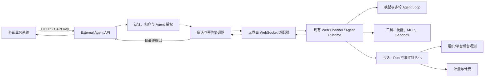
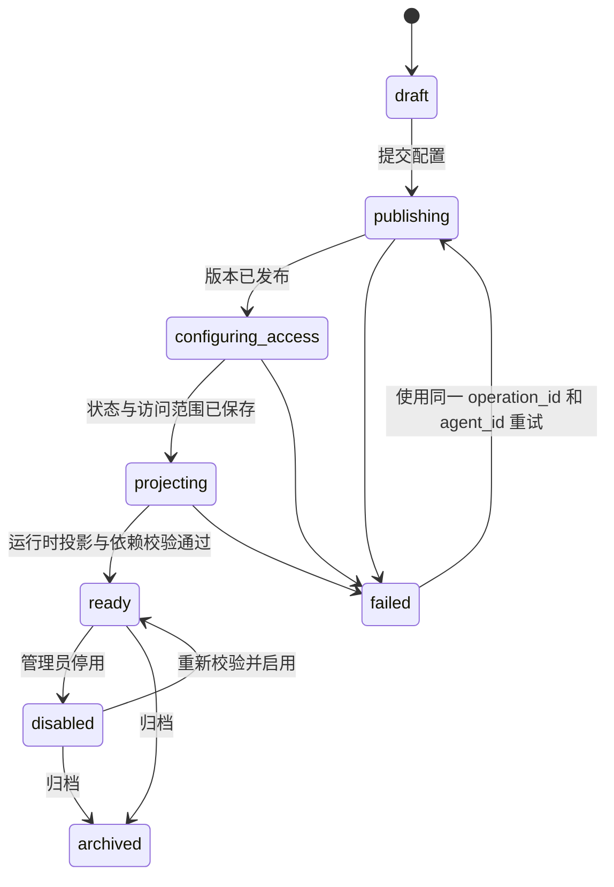

# KY Agent 外部系统调用与组织 Agent 就绪治理方案

> 状态：待评审、待实施
> 创建日期：2026-09-15
> 适用范围：KY Agent 服务端、Web 管理后台、外部系统接入层
> 交付边界：本文只定义产品与技术方案，不包含 Workflow、部署、生产配置或数据迁移变更

---

## 一、结论

KY Agent 可以向外部系统提供完整 Agent 能力，但不应把能力抽象成一次性的“单 Run 模型调用”。推荐方案是：

1. 外部系统通过稳定的 HTTP API 管理会话并提交消息。
2. 服务端内部由一个无界面的 WebSocket 适配器复用现有 Web/Mobile Agent 协议。
3. 同一个外部会话可以连续提交多轮消息，并始终绑定同一个组织 Agent。
4. 每条消息在内部可以触发多轮模型推理、工具调用、子任务、审批和恢复。
5. MVP 默认只向调用方返回 Agent 最终输出，不暴露思考文本和中间执行事件。
6. 平台后台保留完整会话、执行过程、调用身份和计费记录。

该方案成立的前提不是“已经生成 Agent ID”，而是指定组织 Agent 已经达到可运行就绪状态。当前组织 Agent 创建链路存在多步骤半成功风险，因此第一阶段必须先补齐创建、发布、投影、授权和就绪判定。

一句话定义：

> 外部 API 是现有 Agent Runtime 的无界面入口；调用身份决定租户、授权、会话归属和计费，`agent_id` 决定使用哪个组织 Agent 的指令与能力。

---

## 二、概念与页面边界

### 2.1 “智能体规则”不是单个 Agent 的提示词

设置中心中的“智能体规则”对应组织级 `instructions.md`，用于统一整个组织内 Agent 的表达方式、格式偏好和岗位约定。它不是某个组织 Agent 的专属系统提示词。

单个组织 Agent 的专属指令在：

```text
设置 → 组织管理 → 智能体 → 打开具体智能体 → 内部提示语
```

最终提示词由多层内容组合：

```text
平台基础规则
+ Agent Runtime Profile 指令
+ 组织资料与“智能体规则”
+ 指定组织 Agent 的“内部提示语”
+ 当前会话上下文与允许加载的记忆
```

外部 API 不允许调用方直接传入任意 `system_prompt`，避免绕过组织治理、安全规则和审计。需要不同岗位或提示词时，应创建不同组织 Agent 或发布该 Agent 的新版本。

### 2.2 Agent ID 的语义

- `agent_id` 是组织 Agent 的稳定、不可变调用标识。
- 修改名称、头像、指令、模型或技能时，`agent_id` 不变。
- 发布新版本时，`agent_id` 不变，内部版本号变化。
- 删除操作默认应改为停用或归档，避免历史会话失去身份解释。
- 外部请求中的 `agent_id` 只能作为候选标识；最终租户和权限必须由 API Key 对应的服务身份在服务端解析。

MVP 可以直接使用现有治理资源的 `agentId`。后续若需要更稳定的公开命名，可增加独立的 `public_agent_id` 或别名，但不得用可修改的 Agent 名称充当主键。

---

## 三、目标与非目标

### 3.1 目标

1. 外部系统能够发现自己有权调用的组织 Agent。
2. 外部系统能够创建持久会话，并在同一会话内连续多轮交流。
3. 每次消息处理都复用现有 Agent Runtime，而不是退化为单次模型问答。
4. 默认只返回最终结果，同时保证后台可以查看完整过程。
5. 支持模型、推理开关、effort、超时和幂等键等调用参数。
6. 调用身份、Agent 身份、会话身份、执行身份和费用归属可追溯。
7. 组织 Agent 创建失败后可以安全重试，不重复创建孤立资源。
8. 未达到就绪状态的 Agent 不进入外部可调用目录。

### 3.2 非目标

- 不开放调用方任意覆盖系统提示词。
- 不让调用方直接指定或切换 `tenantId`。
- 不把内部 WebSocket 协议直接暴露为公共协议。
- MVP 不向外部返回模型思考文本、工具参数、凭据或内部路径。
- 不在本阶段重写 Agent Runtime、工具系统和会话存储。
- 不在本方案中启用或修改 CI/CD Workflow。

---

## 四、总体架构



### 4.1 为什么采用无界面 WebSocket 适配器

适配器作为内部客户端复用现有 Web/Mobile 运行协议，可以直接获得：

- 会话恢复与消息续接；
- Agent 多轮循环；
- 工具和技能调用；
- 中断、审批、错误和终态事件；
- 现有消息持久化、运行记录和计费链路。

公共 HTTP API 只负责稳定的外部契约，不复制 Agent Runtime。WebSocket 是内部实现细节，未来即使 Runtime Transport 更换，外部 API 也无需变化。

### 4.2 不是“单 Run API”

外部接口的核心资源是 `conversation`，不是 `run`：

```text
一个 conversation
├─ 第一条外部消息
│  └─ 一个 execution，可包含多轮推理和多次工具调用
├─ 第二条外部消息
│  └─ 一个新的 execution，继承同一会话上下文
└─ 后续消息……
```

`execution_id` 只表示一条消息对应的本次执行，主要用于等待结果、重试、取消、审计和计费，不能取代长期会话。

---

## 五、组织 Agent 创建与就绪治理

### 5.1 当前风险

当前创建链路依次执行：

```text
创建治理资源
→ 发布版本
→ 设置状态
→ 保存访问范围
→ 投影到运行时 OrgAgentStore
```

该链路不是一个对用户原子化的操作，可能出现：

- 已生成 `agentId`，但版本发布失败；
- 版本已发布，但状态或访问范围未保存；
- 治理数据已更新，但运行时投影仍 pending 或 failed；
- 首次投影存在，但访问范围仍为空，因此运行时按安全策略拒绝调用；
- 新建页面重试时再次创建资源，产生多个孤立草稿。

因此，“接口返回了 Agent ID”不能作为创建成功或可调用的判据。

### 5.2 目标状态机



对外目录只返回 `ready` 状态。`draft`、`publishing`、`failed`、`disabled`、`archived` 均不得被外部调用。

### 5.3 创建命令

建议将前端当前多次请求收敛为一个服务端应用命令：

```http
POST /api/governance/org-agents
Idempotency-Key: <operation_id>
```

请求包含 Agent 定义、运行策略和访问范围。服务端负责：

1. 第一次请求生成并持久化唯一 `agent_id`。
2. 同一 `Idempotency-Key` 重试时返回同一资源和当前进度。
3. 在数据库事务内写入可原子提交的数据。
4. 通过 durable outbox 执行运行时投影。
5. 投影失败时保存失败原因并支持后台重试。
6. 只有完成运行时 readback 后才标记为 `ready`。

如果短期内不合并现有后端接口，前端也至少必须在第一次创建资源后立即保存 `agent_id` 和 revision；后续步骤失败时继续该资源，不能再次调用创建接口。

### 5.4 就绪判定

一个组织 Agent 只有同时满足以下条件才是 `ready`：

| 检查项          | 判定要求                                      |
| --------------- | --------------------------------------------- |
| 治理资源        | 存在且归属当前租户                            |
| 状态            | `enabled`                                     |
| 版本            | `currentVersionId` 存在且定义校验通过         |
| 运行时投影      | 同 `agent_id`、同租户的运行记录存在且启用     |
| 访问范围        | API Service Principal 对该 Agent 有明确 allow |
| Runtime Profile | `org_agent` Profile 可解析                    |
| 模型            | 继承或固定模型可用，且租户有权使用            |
| 工具与技能      | 引用合法，禁用项按 fail-closed 处理           |
| 执行模式        | dispatcher 等附加依赖校验通过                 |

管理后台应显示“草稿、发布中、可调用、失败、已停用”及最后错误，不再只显示一个容易误解的启用开关。

---

## 六、身份、组织与授权模型

### 6.1 是否需要为外部客户创建组织

- 已经是平台客户并有独立组织：复用其现有组织。
- 外部调用方尚无组织：为客户创建正式租户组织，不创建所有客户共用的“外部调用组织”。
- 每个外部集成在客户组织内创建独立 Service Principal 和 API Key。
- 同一客户的测试、生产或不同业务系统建议使用不同 Service Principal，便于撤权和计费拆分。

### 6.2 API Key 建议字段

```text
key_id
tenant_id
service_principal_id
name
key_hash
key_prefix
scopes
allowed_agent_ids
status
expires_at
last_used_at
created_by / created_at
revoked_by / revoked_at
```

只存 API Key 哈希；明文只在创建时展示一次。至少支持：

- `agents:read`
- `conversations:write`
- `conversations:read`
- `executions:read`
- `executions:cancel`（可选）

### 6.3 权限解析原则

```text
API Key
→ Service Principal
→ 固定 tenant_id
→ allowed_agent_ids / Assignment
→ 服务端生成可信 agentTarget
```

外部请求不能提供可信 `tenantId`。适配器生成的内部目标为：

```json
{
  "kind": "org-agent",
  "tenantId": "由服务端身份解析",
  "orgAgentId": "通过授权校验后的 agent_id"
}
```

同一会话在首次创建时绑定 Agent。后续消息如果再次传入不同 `agent_id`，服务端必须返回冲突；切换 Agent 需要新建会话。

---

## 七、外部 API 契约

### 7.1 查询可调用 Agent

```http
GET /v1/agents
Authorization: Bearer <API_KEY>
```

只返回当前 Service Principal 有权调用且状态为 `ready` 的 Agent：

```json
{
  "data": [
    {
      "id": "org-550e8400-e29b-41d4-a716-446655440000",
      "name": "订单分析助手",
      "description": "分析订单异常并给出处理建议",
      "capabilities": {
        "attachments": true,
        "reasoning": true
      },
      "defaults": {
        "model": "inherit",
        "reasoning_effort": "medium"
      }
    }
  ]
}
```

不返回 Agent 内部提示语、工具明细、门禁规则、知识资源 ID 或租户 ID。

### 7.2 创建会话

```http
POST /v1/conversations
Authorization: Bearer <API_KEY>
Idempotency-Key: <unique-key>
Content-Type: application/json
```

```json
{
  "agent_id": "org-550e8400-e29b-41d4-a716-446655440000",
  "external_conversation_id": "order-20260915-001",
  "metadata": {
    "order_id": "SO-10086"
  }
}
```

返回：

```json
{
  "id": "conv_01K...",
  "external_conversation_id": "order-20260915-001",
  "agent_id": "org-550e8400-e29b-41d4-a716-446655440000",
  "status": "active",
  "created_at": "2026-09-15T10:00:00.000Z"
}
```

`external_conversation_id` 在同一个 Service Principal 下唯一，可用于调用方安全重试和业务主键关联。

### 7.3 向会话发送消息并等待最终结果

```http
POST /v1/conversations/{conversation_id}/messages
Authorization: Bearer <API_KEY>
Idempotency-Key: <unique-key>
Content-Type: application/json
```

```json
{
  "message": "分析这个订单是否存在风险，并给出处理建议。",
  "attachments": [],
  "model": "inherit",
  "reasoning": {
    "enabled": true,
    "effort": "high"
  },
  "response_mode": "final",
  "wait_timeout_ms": 120000
}
```

参数语义：

| 字段                | 说明                                                   |
| ------------------- | ------------------------------------------------------ |
| `message`           | 本轮用户输入，必填                                     |
| `attachments`       | 可选附件引用，必须先通过受控上传接口取得               |
| `model`             | `inherit` 或租户允许的模型标识；Agent 固定模型策略优先 |
| `reasoning.enabled` | 是否允许推理能力；不表示向外返回思考文本               |
| `reasoning.effort`  | `low`、`medium`、`high` 等受支持档位                   |
| `response_mode`     | MVP 固定支持 `final`                                   |
| `wait_timeout_ms`   | HTTP 最长等待时间，不是 Agent 总执行超时               |

在等待时间内完成时返回 `200`：

```json
{
  "conversation_id": "conv_01K...",
  "execution_id": "exec_01K...",
  "status": "completed",
  "output": {
    "text": "该订单存在两个风险……"
  },
  "usage": {
    "model": "effective-model-id",
    "reasoning_effort": "high"
  },
  "completed_at": "2026-09-15T10:01:20.000Z"
}
```

超过 HTTP 等待时间但 Agent 仍在执行时返回 `202`，任务继续运行：

```json
{
  "conversation_id": "conv_01K...",
  "execution_id": "exec_01K...",
  "status": "running",
  "result_url": "/v1/executions/exec_01K..."
}
```

### 7.4 查询最终结果

```http
GET /v1/executions/{execution_id}
Authorization: Bearer <API_KEY>
```

只返回 `queued`、`running`、`completed`、`failed`、`cancelled` 等状态。完成后返回最终输出；不返回 chain-of-thought、内部工具参数、凭据或本地路径。

### 7.5 多轮续聊

调用方继续向同一个 `conversation_id` 发送消息即可复用完整会话：

```http
POST /v1/conversations/conv_01K.../messages

{
  "message": "继续比较第二个供应商，并结合刚才的结论。",
  "model": "inherit",
  "reasoning": {
    "enabled": true,
    "effort": "medium"
  },
  "response_mode": "final"
}
```

服务端不得为每条外部消息创建全新的无上下文会话。

---

## 八、无界面 WebSocket 适配器职责

适配器负责协议转换，不拥有业务权威数据：

1. 将可信 Service Principal 映射成内部执行身份。
2. 创建或恢复内部 `sessionId`。
3. 将外部 `conversation_id` 映射到唯一内部会话。
4. 将已授权 `agent_id` 转换成 canonical `agentTarget`。
5. 按现有 WebSocket 协议提交消息、模型、推理和附件参数。
6. 持续消费内部事件，并把事件写入现有持久化链路。
7. 识别真正终态，提取最终 assistant 输出。
8. HTTP 断开时不取消 Agent；调用方可用 `execution_id` 查询结果。
9. 重连后从持久状态恢复，不能依赖单个 Node 进程内存等待。
10. 使用 `Idempotency-Key` 防止网络重试造成重复执行或重复副作用。

适配器不得：

- 直接拼接或覆盖系统提示词；
- 信任调用方传入的 tenant、session、owner 或计费身份；
- 把 API Key 或用户 OAuth 凭据传入 Sandbox；
- 仅依据某个 WebSocket `done` 字符串判断完成而忽略持久化终态；
- 在外部连接断开时丢弃内部运行映射。

---

## 九、会话、过程可见性与计费

### 9.1 后台会话可见性

平台管理员和对应组织管理员应能查看：

- 外部会话 ID 与内部 session ID；
- 客户组织、Service Principal、API Key 前缀；
- 组织 Agent 名称、`agent_id` 和执行时版本快照；
- 用户输入与 Agent 最终输出；
- 模型调用、工具调用、审批、错误、重试和耗时；
- execution/run/invocation/attempt 等关联 ID；
- 当前状态和失败原因；
- 用量与费用明细。

外部 API 默认只返回最终输出，但内部过程必须完整保存。这是“输出裁剪”，不是“过程不记录”。

### 9.2 数据归属

```text
tenant_id                 费用与数据所属客户
service_principal_id      具体哪个外部系统调用
agent_id + version_id     使用了哪个 Agent 配置
conversation_id           多轮业务会话
execution_id              本轮消息执行
session_id / run_id       内部 Runtime 关联
idempotency_key           外部请求去重
```

### 9.3 计费维度

至少记录：

- 输入、输出、缓存和推理 Token；
- 实际生效模型，而不只是调用方请求模型；
- 工具、MCP、浏览器和 Sandbox 使用量；
- 图片、音频等多模态用量；
- 执行总时长和失败阶段；
- 平台定价版本、成本和对客户计费金额；
- 重试、恢复和幂等命中是否计费。

计费归属应落在客户组织，同时可以按 Service Principal、Agent、会话和业务 metadata 分摊。

---

## 十、安全与失败策略

| 场景                              | 行为                                           |
| --------------------------------- | ---------------------------------------------- |
| API Key 无效、过期或撤销          | `401`，不泄漏 Agent 是否存在                   |
| `agent_id` 不属于当前租户或未授权 | 统一返回 `404` 或授权拒绝，防枚举              |
| Agent 未 ready                    | `409 agent_not_ready`，携带可支持的诊断 ID     |
| 同一会话切换 Agent                | `409 conversation_agent_mismatch`              |
| 同一幂等键、相同请求              | 返回原 conversation/execution                  |
| 同一幂等键、不同请求体            | `409 idempotency_conflict`                     |
| HTTP 等待超时                     | `202`，内部继续执行                            |
| WebSocket 临时断开                | 适配器恢复连接并按 durable 状态续接            |
| Agent Runtime 失败                | `failed`，外部返回稳定错误码，后台保留内部详情 |
| 外部取消                          | 仅在拥有 `executions:cancel` 权限时传播取消    |
| API Key 轮换                      | 旧 Key 可设置短暂重叠期，按 key_id 分开审计    |

任何错误响应都不能回显系统提示词、凭据、文件路径、工具原始密钥或其他租户信息。

---

## 十一、管理后台改造

### 11.1 智能体列表

在当前 Agent 名称下方的 ID 基础上，增加：

- 明确标签“调用标识”；
- 复制按钮；
- “可调用 / 发布中 / 投影失败 / 未授权 / 已停用”状态；
- 当前版本和最后发布时间；
- “查看创建操作”入口。

### 11.2 Agent 详情

明确区分：

- 公开说明：给成员和 Agent 目录展示；
- 内部提示语：该 Agent 专属系统指令；
- 组织智能体规则：组织统一行为规则，只读引用；
- 外部调用：Service Principal 授权、默认模型和调用示例；
- 运行策略：模型、最大轮次、工具、技能、记忆与执行环境；
- 版本记录：发布人、发布时间、变更原因和回滚版本。

### 11.3 外部调用管理

新增组织级管理页，提供：

- Service Principal 创建、停用和删除；
- API Key 创建、轮换和撤销；
- 可调用 Agent 范围；
- 调用量、成功率、耗时和费用；
- 最近会话与完整执行过程；
- 按外部业务 ID、Agent、时间、状态筛选。

---

## 十二、实施阶段

### 阶段 P0：组织 Agent 创建闭环

目标：确保 Agent 可以稳定创建、重试并达到 `ready`。

- 为创建操作增加 `operation_id` / `Idempotency-Key`。
- 修复失败重试可能重复创建资源的问题。
- 暴露并持久化发布、Assignment 和投影状态。
- 增加服务端就绪判定和 readback。
- 管理页面展示准确状态与失败原因。
- 补齐创建、半失败、重试、投影失败和恢复测试。

退出条件：连续创建多个 Agent 不产生孤立重复资源；每个成功 Agent 均能由真实 Runtime 创建会话并完成一次带工具或多轮推理的测试。

### 阶段 P1：外部调用 MVP

目标：外部系统能够发现 Agent、建立会话并获得最终输出。

- 增加 Service Principal 与 API Key。
- 实现 `GET /v1/agents`。
- 实现会话创建、消息提交和 execution 查询。
- 实现内部无界面 WebSocket 适配器。
- 支持 `model`、`reasoning.enabled`、`reasoning.effort` 和等待超时。
- 默认只返回最终文本结果。
- 实现会话 Agent 固定、幂等和租户隔离。

退出条件：外部 HTTP 客户端能在同一 conversation 连续对话两轮；其中至少一轮触发多步 Agent 执行，最终结果正确，后台能看到完整过程。

### 阶段 P2：管理与计费闭环

目标：组织和平台后台能够运营外部调用。

- 增加 API Key 管理与轮换。
- 增加外部会话和执行过程筛选。
- 按组织、Service Principal、Agent、模型汇总用量和费用。
- 增加配额、并发、速率限制和预算告警。
- 支持业务 metadata 检索和对账导出。

### 阶段 P3：可靠性与扩展

- Webhook 完成通知。
- 流式最终内容或受控事件流。
- 批量任务和异步队列。
- Agent 公开别名与版本钉住策略。
- 多地域、灾难恢复和更细粒度 SLA。

---

## 十三、测试与验收

### 13.1 组织 Agent 创建

1. 创建请求超时后使用相同幂等键重试，只产生一个 `agent_id`。
2. 版本发布成功、Assignment 失败时 Agent 不可调用，后台展示明确错误。
3. 投影失败后重试成功，同一 `agent_id` 进入 `ready`。
4. 停用 Agent 后立即从 `/v1/agents` 消失，新建会话被拒绝。
5. 修改 Agent 名称和提示词后 ID 不变，新会话使用新版本。
6. 历史会话仍保存执行时 Agent 名称和版本快照。

### 13.2 外部调用

1. 正确 API Key 只能看到被授权且 ready 的 Agent。
2. 跨租户 `agent_id` 无法枚举和调用。
3. 同一个 conversation 连续两轮消息保留上下文。
4. 一条消息内部可以进行多轮推理和工具调用，外部只收到最终结果。
5. 请求模型被 Agent 固定策略覆盖时，返回实际生效模型。
6. HTTP 等待超时返回 `202`，稍后查询可以取得相同最终结果。
7. 相同幂等键不会重复执行有副作用的工具。
8. 同一会话更换 `agent_id` 被拒绝。
9. API Key 撤销后新请求立即失败，已有执行按明确策略继续或取消。

### 13.3 后台与计费

1. 后台可由外部业务 ID 定位唯一会话和 execution。
2. 能查看消息、模型、工具、错误、耗时和最终输出。
3. 外部不可获取内部思考文本、凭据和敏感工具参数。
4. 用量可以按组织、Service Principal、Agent 和模型汇总。
5. 账单明细与 Runtime 实际使用量可对账。

### 13.4 验收证据

端到端验收必须至少保留：

- 外部 HTTP 请求与响应；
- 内部 conversation/session/execution/run 关联 readback；
- 管理后台完整过程截图或接口 readback；
- 实际生效 Agent ID、版本和模型；
- 用量与计费记录；
- 跨租户、撤权和幂等测试结果。

单元测试、CI 通过、健康检查或 WebSocket 连接成功都不能单独替代以上业务验收。

---

## 十四、建议代码落点

| 能力                        | 建议位置                                             |
| --------------------------- | ---------------------------------------------------- |
| 公共 API 路由               | `server/src/routes/externalAgents.ts`                |
| API Key / Service Principal | `server/src/data/externalIdentities/`                |
| 会话映射与幂等              | `server/src/data/externalConversations/`             |
| 无界面 WebSocket 适配器     | `server/src/externalAgent/headlessWebClient.ts`      |
| 最终结果聚合                | `server/src/externalAgent/finalOutputCollector.ts`   |
| Agent readiness             | `server/src/data/agentResources/readiness.ts`        |
| 创建编排命令                | `server/src/services/orgAgentProvisioningService.ts` |
| 管理后台                    | `web/src/components/ExternalAgentAccess/`            |
| 共享契约                    | `shared/src/types/externalAgent.ts`                  |

具体文件名可以在实施时按现有模块边界调整，但必须保持公共 API、内部适配器、Runtime 和治理数据之间的职责分离。

---

## 十五、需要在实施前确认的产品决策

1. 一个 API Key 是否只绑定一个 Agent，还是允许绑定多个 Agent。
2. 外部会话最长保留时间和客户删除策略。
3. HTTP 同步等待上限以及默认 `wait_timeout_ms`。
4. 是否允许外部调用方选择具体模型，还是只能选择模型档位。
5. reasoning effort 的允许值及不同模型不支持时的降级策略。
6. API Key 撤销时是否取消已经在运行的 execution。
7. 外部调用费用是包含在组织套餐内，还是单独计费。
8. Agent 更新后，已有会话继续使用创建时版本还是自动使用最新版本。

MVP 推荐：

- 一个 Service Principal 可授权多个 Agent，一个 API Key 继承其授权；
- 会话固定 Agent，但默认使用每次执行时的最新已发布版本，并保存版本快照；
- 外部可请求模型和 effort，但最终受 Agent Profile、租户额度和平台 allowlist 约束；
- 默认同步等待 120 秒，超时返回 `202`；
- API Key 撤销只阻止新请求，不自动取消已经进入 Runtime 的执行；
- 所有费用归属客户组织，并按 Service Principal 单独出明细。

---

## 十六、最终交付判定

只有同时满足以下条件，才能宣布“外部系统可以复用 KY Agent 能力”：

1. 组织 Agent 创建、发布、授权和投影可可靠完成并可重试。
2. 外部调用方能通过正式接口发现可调用的稳定 `agent_id`。
3. 外部调用建立的是持久多轮会话，而不是单次无上下文 Run。
4. 每条消息内部复用完整 Agent Loop、工具与技能体系。
5. 外部默认只获得最终结果，后台保留完整执行过程。
6. 租户隔离、Agent 授权、幂等、撤权和失败恢复通过端到端验证。
7. 会话、Agent 版本、实际模型、用量和费用能够关联并对账。
