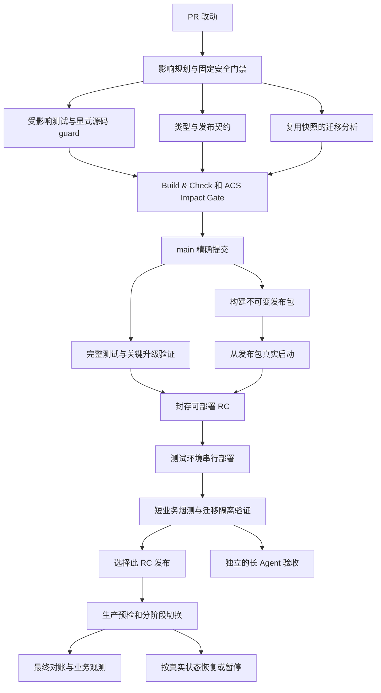

# CI/CD 全链路审计与改进方案

审查日期：2026-09-08，北京时间。代码基线：a6b6865eba98cb0b4c08bf8f0359e8200aec7768；审查开始时本地 main 与 GitHub main 一致，工作区干净。

本次覆盖 5 个 Workflow、PR 选测与门禁、不可变产物构建、测试部署与验收、生产发布与回滚、配置身份、数据库迁移、ACS 交接及 GitHub 现场规则。三个独立审查分工负责 CI、Staging、Production，主审交叉核实关键发现。取证使用代码、GitHub runs/jobs/steps/日志、匿名只读健康检查和本地隔离复现；没有触发工作流、重跑远端任务、发布、改云端配置或生产数据库。

配套 [脱敏证据摘要](./cicd-workflow-audit-2026-09-08.evidence.json) 包含运行样本、逐步骤耗时、现场规则、公开版本身份和本地复现结果。

## 结论

现有链路值得继续改造。它已经具有按影响范围选测、并行分片、精确 SHA 门禁、不可变 RC、同一产物晋级、蓝绿 API/Worker、配置身份和失败回执等基础。问题主要集中在：一个昂贵的历史迁移分析支配 CI；源码测试没有充分覆盖实际产物和多进程升级；发布控制面与业务发布耦合；正常门禁严格，但遇到不健康基线后的恢复路径不够直接。

优先顺序应为：**先修复发布失败可能被汇总成成功的组合漏洞，消除已证实的漏测和恢复缺陷，同时优化迁移分析；随后建立真正的产物启动/升级门禁，再统一发布入口和自动恢复。** 不应先减掉安全检查、扩大生产并行度，或迁移整套基础设施。

这是审计与可执行的实施方案，尚未应用下文建议的代码和流程变更。耗时目标是待验证的工程目标，不是已经取得的效果。

## 实测基线

### 当前线上状态

2026-09-08 08:19 左右，生产 live、生产 ready、测试 ready 均为 HTTP 200。生产 Web identity、生产和测试 API readiness 都绑定 rc-20260907-84 / a6b6865e；两环境报告的 Server、Web、ACS Orchestrator 和 Sandbox digest 一致。这证明该时刻的公开就绪状态和组件身份，不能证明全部业务可用。

生产最近六次发布成功。近期失败频繁的感受有历史运行记录支持，但不能把历史失败率等同于当前线上不可用率，也不能把部署前阻断等同于已经造成停机。

### 样本与口径

| 范围                      | 观察结果                                                             | 解释                                             |
| ------------------------- | -------------------------------------------------------------------- | ------------------------------------------------ |
| 最近 45 次 APP CI         | PR 31 次：16 成功、6 失败、9 取消；push 14 次全部成功                | PR 取消常是新提交淘汰旧检查，单独计数            |
| 上述成功 PR               | 中位 10 分 09 秒；最近秩 P95 11 分 58 秒                             | 16 个成功样本，P95 接近尾部样本，不代表长期 SLO  |
| 上述成功 main push        | 中位约 10 分 12 秒；最近秩 P95 10 分 52 秒                           | 14 个成功样本                                    |
| 最近 40 次 Staging        | 15 成功、23 失败、2 取消；创建时间覆盖 9 月 1 日至 9 月 8 日北京时间 | 包含多个已修问题和重试，不能作为当前版本故障概率 |
| 最近 20 次生产发布        | 7 成功、10 失败、3 取消；最近 6 次成功                               | 创建时间覆盖 8 月 30 日至 9 月 8 日北京时间      |
| 可查询的独立 Staging 验收 | 2 次，均失败；分别在 8 月 30 日和 9 月 1 日                          | 本轮没有成功业务验收记录可用于证明保护有效       |

运行总时长采用创建到更新时间；具体瓶颈采用 job/step 的开始结束时间。重跑的 run 总时长可能包含人工间隔，不能与单个 attempt 执行时长混用。统计是有限、近期样本，并非全历史普查。

上述 APP/ACS 最近 45 条样本窗口为 9 月 7 日 21:42:23 至 9 月 8 日 07:14:24 北京时间，均为 attempt=1；ACS 成功 PR/push 中位约 2 分钟，明显不是当前发布关键路径。另扩展 APP/ACS 各 100 条到约 30 小时窗口，用于区分真正 rerun；只发现一个 APP attempt=2 的重跑成功案例，首轮为 cronRuntimeRecovery 等待超时。不能把其余 PR 失败一并归为偶发测试。

### 一次完整发布的真实关键路径

参照同一 SHA 的 [APP CI 34169355270](https://github.com/ZengLeiPro/agent-saas/actions/runs/34169355270)、[Staging 34169361409](https://github.com/ZengLeiPro/agent-saas/actions/runs/34169361409)、[Production 34171082432](https://github.com/ZengLeiPro/agent-saas/actions/runs/34171082432)。

| 阶段       | 总耗时      | 主导因素                                                                             |
| ---------- | ----------- | ------------------------------------------------------------------------------------ |
| APP CI     | 10 分 50 秒 | 历史迁移审核单步 432 秒；测试分片约第 203 秒已结束；静态检查 job 自身耗时 591 秒     |
| Staging    | 29 分 24 秒 | 等待 APP CI 636 秒；生产基线产物绑定 149 秒；构建 RC 90 秒；实际后端/ACS 部署 294 秒 |
| Production | 15 分 37 秒 | ACS 172 秒；App 118 秒；Web 109 秒；迁移完成核验 200 秒；预取产物 82 秒              |

Staging 于 07:14:31 开始，APP CI 于 07:14:24 开始，因此 636 秒等待与 APP CI 重叠。Staging 到 07:43:55 完成；生产 07:45:14 开始、08:00:51 完成。从 main CI 开始到生产发布完成，约 **46 分 27 秒**，不能把三个总时长直接相加。此前的 PR 检查另计。

Staging 的“29 分钟”也不是 29 分钟在编译：还有内容寻址上传约 77 秒、选定产物物化约 48 秒、GitHub Release 与证明约 65 秒、Web 发布约 99 秒，以及证据和收尾。最新生产依赖安装只有约 5 秒，优先改依赖缓存无法解决上述分钟级瓶颈。

## 现存问题及处理建议

严重性含义：P1 为应优先处理的发布可靠性或关键门禁问题；P2 为明确的性能、恢复、可维护性或验证完整性问题。下文区分历史事故、隔离复现和仅由控制流证明的条件性风险，没有证据支持把当前链路定性为正在发生 P0。

### F13 / P1：App 交接已经失败，生产最终汇总仍可能写 completed

这是应排在修复优先级首位的组合层漏洞。它与旧 D-01 不同：当前 App 函数已经会在 drain ACK 失败时返回非零，问题出在 Workflow 如何解释这个失败。

触发场景：本次仅更新后端、Web 为 keep；新 API/Worker 已提交 authority，但旧 Worker 的 drain ACK 失败。App 的 committed 标记已设置，因此不会自动回滚已接管的新版本，也没有 rollback-app.attempted。此时所有活动组件仍可能与目标 Manifest 一致，旧 generation 的交接却没有完成证明。

promote-release.yml:588–591 对 deploy_app 使用 continue-on-error。第 622–644 行正确把业务结果写为 failed，但“成功写入 failed 回执”本身会让 receipt_app 步骤成功。第 1139–1166 行最终判断只检查回执上传步骤成功和新活动组件身份一致，没有检查部署动作或回执内容是否成功。Web 为 keep 时，即使 Web 部署步骤被跳过，组件也已等于目标。

已在本地调用真实 writeOperationReceipt、reconcilePromotion，并执行从当前 YAML 提取的最终结果决策片段复现：**回执内容 failed，reconciler 为 completed，最终结果仍为 completed。** 未执行生产交接，不能据此宣称最近六次成功发布都是假成功。

实施：把“活动组件已达目标”和“操作/交接已成功”作为两个独立必要条件。最终状态必须验证实际动作终态、与 RC/attempt/generation 绑定的持久回执及旧进程 handoff ACK；任何已记录的 failed 不能因上传成功被抹掉。已提交新版本但交接失败应进入明确的 needs_human 或受控 handoff 恢复状态，不盲目回滚长任务。测试覆盖 backend-only/Web keep、ACK失败、失败回执上传成功、旧 generation 仍活动、readback 成功等完整组合。

### F01 / P2：历史迁移分析支配整个 CI

证据：ci.yml:92 的 preflight_checks 不依赖 ci_plan 的影响范围，检查后仍执行 check-reviewed-migrations.mjs。该脚本第 12–29 行逐一遍历当前 33 个历史基线，对每个基线重新 createMigrationPlan。最新 PR 和 push 的这一步分别约 430、432 秒，另一 push 为 437 秒。

migration-plan.mjs 的每次调用重新创建快照/依赖分析缓存，重复读取目标提交和解析启动闭包。单基线本机 profile 约 15.76 秒，产生 1,921 次 git show，其中 1,254 次为不存在对象的失败查询；git show 累计约 10.87 秒。目标不是数据库慢，而是本地静态分析重复启动大量 Git 子进程。

**第一步实施：**在读取源码之前使用已取得的 repository path inventory 和现有候选路径条件做等价预筛；按不可变 Git blob 批量读取内容；在一个分析进程内共享目标快照、AST 和依赖图；给分析阶段增加耗时、Git 调用数和基线数摘要。首先保持所有原有判定和阻断语义。

临时目录中的完整 A/B 实验：同一基线原始 12.785 秒、预筛版本 3.856 秒；整个返回对象 deepStrictEqual=true，两份完整 JSON 的 SHA-256 均为 61e699ee40d437cbc8f0f9ace5ca9140cbf372ee1ed80b501f56cea950f710a7，包含 planDigest、后置条件和所有阻断理由。这是本机单基线实验，不是全 CI 加速结果；上线前仍须对全部历史基线、新增/删除/重命名、动态导入和失败用例进行完整输出等价比较。

**第二步实施：**再考虑有限并行和跨 run 缓存。缓存必须覆盖源 blob、路径树与模块解析、分析器及 TypeScript/lock 版本、审核表和后置条件；不得只以“本 PR 没改 migration 目录”或单个配置文件摘要跳过。生产启动闭包分散在多个运行时 store，未知依赖继续阻断。

历史检查只验证源码分类，刻意把缺少后置条件与分类错误分开；实际 RC 仍按选定生产基线生成并验证完整计划。不能把历史清单成功当作所有历史升级路径都可部署，也不能把历史基线随意删掉来提速。

### F02 / P1：affected 选择会漏掉读取源码的 guard 测试

证据：scripts/ci-plan.mjs 将普通 web/src/*.ts 改动交给 Vitest changed/import graph。useChatAppState 的 approvalTier、resumeCursor、swGuard 三个测试通过 fs 读取源文件进行断言，没有静态 import 边。

使用仓库已安装的 Vitest 4.0.18 仅执行测试收集、模拟该源文件为 changed 的隔离探针，发现这三个匹配测试均未被选中。未修改工作区或执行线上测试。main 全量会再覆盖它们，因此这是 **PR 合入前门禁的缺口**，不是所有阶段都漏测。

实施：建立显式 source-guard/test-resource 依赖映射，或让这类体积小的 guard 始终执行；对空选集输出原因、计数和必要的升级到全量策略。先补完整性，再减少分片。不能把所有空分片一律判错，合法的小改动确实可能使部分 shard 为空。

### F03 / P1：独立浏览器验收缺必需输入，且业务成功不属于生产门禁

证据：e2e/staging/acs-isolation.spec.ts:5 无条件读取 STAGING_ISOLATION_SUMMARY。deploy-staging.yml:1256 设置此变量，但它仅属于那个 workflow job；staging-acceptance.yml 未下载对应 summary，也未设置这个变量。

[验收 run 33467363955](https://github.com/ZengLeiPro/agent-saas/actions/runs/33467363955) 的失败日志显示首个测试 readFile 收到 undefined，随后 15 个测试未执行。e2e/playwright.config.ts 设置 CI maxFailures=1，放大了输入缺失的后果。当前源代码仍有该缺口。

Production 在 promote-release.yml:176–180 只要求七项确定性部署检查：ACS health、API readiness、不可变产物、迁移读回、反向隔离、runtime identity、Web 读回。独立浏览器/Agent 验收是手动可选，未成为生产批准条件。已有大量单测不能替代这里缺失的用户路径证明。

实施：下载并校验绑定同一 RC、Manifest digest、deployment/attempt 的隔离 summary，或者受控重新采集；测试开始前一次校验全部必需输入。不要伪造一个通过的 summary，也不要简单跳过失败用例。

将验收分成两层：每个 RC 必过的短、确定性业务烟测；较长、依赖外部模型和真实工具的 Agent 验收单独运行。修复后的最小烟测必须纳入 RC verified 与生产批准，并更新相应 evidence schema/reader。不能仅把目前可能运行 80 分钟的整套验收直接变成所有 PR 的必过项。

### F04 / P1：Writer 升级失败后，同 SHA 直接重跑可能无法恢复

证据：deploy-staging.yml:172 每次重新 tar -czf 打包 Writer，归档包含文件时间；deploy-evidence-writer.sh:16 按源码 SHA 定义不可变目录，第 62–71 行若该目录存在，则要求归档 digest 完全相同。首次安装新目录后，如果启动或能力验证失败，脚本恢复旧 current，但保留新目录。

同 SHA 重跑再次需要升级，新生成文件的时间改变归档摘要，随即在目录复用校验处失败。已使用真实检查片段和相同文件内容、仅改变时间的归档隔离复现：摘要不同，退出码 1。没有连接线上主机。

实施：Writer 在可信 CI 构建一次，持久化且重跑下载同一包；目录按 digest 定址，源码 SHA 作为来源信息。可同时规范 tar 排序、mtime、owner/group 以提高可复现性。保持不可变校验，禁止用覆盖旧目录或删除核验作为“修复”。增加首次切换后失败、回滚后重跑、连接中断的执行级测试。

### F05 / P2：发布控制面自己的升级、版本和自举能力混在业务部署里

Writer 检测只比较 schema revision（deploy-staging.yml:77–85），不比较实现版本或 bundle digest。同 schema revision 的 bugfix 不会通过这个入口部署；capabilities 也没有相应实现身份。若 Writer 已不可达，第 70 行先失败；若新 schema 不在旧 supported 列表，第 71–76 行先失败，无法进入后面的升级路径。

这是代码证明的版本管理和恢复缺口，未发现对应未修线上事故的直接记录。近期 #569、#571 的入口修复已落地，不能重复报为当前启动 bug。

实施：为 Writer 明确 implementation digest、protocol/schema compatibility 和健康状态三个维度；使用独立、不可变的控制面制品和受控升级/恢复入口。业务部署只检查已满足的兼容性；自动修复必须限定可信制品和固定主机身份，纳入共享主机锁与 fencing，并验证回滚。当前 Writer 脚本依赖 Workflow 互斥，不能假定它已具备主机级锁。协议可读不等于实现已经升级，不可达也不应只能靠业务 PR 解锁。

### F06 / P1：不健康的生产基线会阻塞新 RC 和正常生产修复

新证据依赖只读获取在线生产状态（deploy-staging.yml:620）；生产正常晋级在任何写入前也读取当前生产前缀并验证 ConfigIdentity（promote-release.yml:240–269）。read-live-production-components.mjs:115–136 要求 Worker readyfile 与 systemd MainPID 一致；第 219–222 行还要求公开 ready 成功。

历史 [Staging run 34053155693](https://github.com/ZengLeiPro/agent-saas/actions/runs/34053155693) 就在读取生产 Worker readyfile 时失败，目标部署尚未开始。当前 memory-polling/配置热更新的旧根因已有专门修复；但“正常发布必须从健康基线开始”的设计仍在。

正常部署拒绝未知基线是合理的。缺少的是：**在生产已坏时，有一条同样严格、但不依赖旧进程 ready 的恢复流程。** 仓库已有回滚脚本、部分发布前缀重试和配置恢复能力，不能说完全不能恢复；目前这些能力没有形成用户可直接选用的统一 Workflow 恢复操作。

实施：将最近成功提交的 release ledger 作为期望状态，将主机 marker/字节/进程/DB 状态作为独立观测；提供明确的 repair-config、resume-release、rollback-runtime 操作。恢复绑定精确源与目标、主机 fencing 和可用数据库兼容性；观测未知项需显式列出。目标候选仍必须在隔离端口通过自身 readiness、身份和最小业务门禁后才能切流。禁止通过接受漂移摘要、重写 expected digest 或把 503 当作成功绕过正常门禁。

### F07 / P1：ACS 仍为单实例交接，并可能把强制退出当作成功排空

deploy-production-release.sh:1411–1423 向唯一 ACS 发 SIGUSR2，等待 systemd 不再 active，再 restart。ACS index.ts:946–968 会停止接新连接，并在仍有 inflight、达到 drainDeadlineMs 时 process.exit(1)。默认配置为 120 秒；本轮未读取生产私有 runtime 配置，不能认定线上实际阈值就是此值。

部署端未把旧进程的“正常排空完成”与“超时异常退出”作为不同结果，随后新实例 health 和 identity 成功即可继续。因此，在存在跨越 deadline 的长执行流时，可能出现工作流成功但旧连接被切断。systemd 自动重启还会使仅检查 active 状态更加不足。本轮没有证据证明最近成功生产发布实际发生了此中断。

短期实施：以进程 generation、排空回执、inflight、退出结果验证交接；超时记录真实业务影响与降级状态，禁止把异常退出写成无损成功。上线前通过长 SSE/执行流并行部署演练验证。

server/src/runtime/httpTransport.ts 当前连接重试退避为 1+3+6 秒；若 ACS 停接新连接的排空窗口超出它，新调用也可能失败。已建立流不盲目重试是为避免重复外部副作用，应保留。仅延长 ACS 排空 deadline 不能消除新调用窗口，需要路由、队列或协议层的可恢复行为。

中期实施：若要求 ACS 更新期间持续接新工作，采用可并存 generation 与明确的路由/lease fencing；或者为短暂停止新调度建立可恢复队列与客户端重试协议。必须先解决生命周期控制器/leader 和任务所有权，不能简单开两份 ACS 就宣称高可用。

### F08 / P2：具体迁移后置 SQL 仍可能通过，但业务写入失败

D-03 的“没有执行真实数据库后置检查”已经修复。当前 config/release-migration-postconditions.json 已有 providerQuotaSnapshotStore 对应三组基线，不是空目录。

然而现有 SQL（第 13、27、41 行）主要检查关系存在、五列名称和类型，没有核验 id 的自动生成默认值/序列、相关 NOT NULL/PK、updated_at default，索引只检查名称存在，未检查定义及 indisvalid/indisready。

已在独立 PostgreSQL 16 临时集群复现：建成列类型和索引都满足现有 SQL、但 id 缺默认值的历史表，调用当前 readMigrationPostconditions 得到 passed；随后执行与 setPlanExpiry 相同形式的 INSERT，得到 23502 / id NOT NULL。临时集群已停止并清理，没有接触现有业务数据库。该复现证明检查集合不充分，不证明生产当前 schema 已损坏。

实施：为实际业务依赖补 default/sequence/PK/约束/索引定义与有效性；在 Staging 运行迁移前后真实业务写入读回；在可丢弃数据库上验证 N→N+1，并验证旧代码对新 schema 的兼容性。生产保留只读后置条件，不把有副作用的试写塞进生产迁移验证。

### F09 / P2：构建、打包、启动和升级之间的测试断层

APP CI 会 build，但发布用的 pnpm deploy、tgz 文件集合、入口方式、systemd cwd、文件权限和 API/Worker 多进程组合要到 Staging 才真正运行。build-release.mjs:288–336 又构建并封装 Server/Web/ACS；这些产物没有作为 APP CI 的常规实际启动门禁。

Writer #569 / #571 是具体历史例子：源码服务测试、绝对 symlink 入口 smoke 与 systemd 工作目录下的相对入口并不等价，bundled 依赖中的 CLI 入口判断可在后一种方式误触发。#571 已通过 EMBEDDED 构建定义修复；教训是要测试实际启动方式。

实施：在 Linux 隔离环境从最终发布包解压，用生产相同入口/cwd/权限启动 Writer、API 与 Worker，调用真实 HTTP 能力/readiness，验证退出与日志；补原生依赖/静态资源/管理 CLI。对 runtime/config/Hand/ACS 改动增加 N→N+1 多进程升级与长任务交接。仓库现有 verify:multiprocess / chaos 脚本没有接入这五条 workflow，适合筛出确定性短场景作为发布门禁，而非把全部 chaos 放进所有 PR。

还需处理环境部署方式的差异：deploy-staging-release.sh:629–636 对 Staging App 原位 systemctl restart；生产 App 使用蓝绿 generation、authority 提交与旧任务 drain。相同包在 Staging 能启动，不代表生产交接状态机已被演练。应逐步让两环境复用同一执行器，把域名/账号/资源隔离保留为配置差异，并在 Staging 持续运行任务期间完成升级。ACS 两环境目前均为单实例 drain/restart，不能说 Staging 完全没有 drain。

源码结构断言仍有价值，但不能用“脚本含有 rollback 字符串”替代执行脚本后的最终状态核验。新增测试应覆盖这些已知行为断层，避免继续堆叠只镜像代码文本的断言。

### F10 / P2：发布执行器过大，多代入口增加修改和维护成本

当前 5 份 YAML 合计 7,332 行，其中 ci.yml 3,503 行。scripts/release 目录约 39,721 行，含测试约 21,203 行、非测试约 18,518 行；这说明发布机制本身已是一个需要独立维护的软件系统，不能仅当几段运维命令。

ci.yml:637 起的 legacy deploy-ecs 有两千余行，但上游第 625–626 行会对 ecs_required=true 先阻断，正常控制流不可达。真实生产 App 走 promote-release，而 Web 和 ACS 仍有兼容入口。部分 zero-downtime/release-governance 文档描述的是旧代行为。

实施：先用调用图、触发条件和契约测试证明不可达，再移除历史 ECS job；把仍需保留的兼容恢复动作归并到显式 recovery 命令。Workflow 只编排，发布逻辑通过版本化、结构化 CLI 实现，逐步替换内嵌 shell。保留既有主机锁、不可变记录和阶段回执，不做一次性整套重写。

### F11 / P2：等待、取消和共享环境串行策略没有围绕已选发布对象组织

PR 同分支淘汰旧 run 是合理的；ci.yml:41–44 对 main push 也 cancel-in-progress=true，而 Staging 等待的是精确 SHA 的 push run。新 main 提交若取消已选 SHA 的 CI，Staging 会据 canceled 结论失败。代码可证明该竞争条件，本轮近期成功 push 样本没有证明实际触发。

Staging 构建、Writer 保障、生产基线证据、部署，以及最长 120 分钟的独立验收，共用 staging-runtime workflow 级锁。只要验收持有共享环境，后续发布就只能等待。GitHub 默认 concurrency 同组仅保留一个 pending；cancel-in-progress=false 不代表完整排队。当前官方还支持 queue:max，但应根据是否保留每个待发布请求选择，而不是无条件排满 100 个过时 RC。[GitHub concurrency 文档](https://docs.github.com/en/actions/how-tos/write-workflows/choose-when-workflows-run/control-workflow-concurrency)

实施：PR 按 PR 取消旧检查；不可变产物准备在环境写锁之外完成；只在 CI 成功后创建可部署候选；已明确选作发布的 SHA 必须拥有可靠完成的检查。实际环境 mutation 与对应短验收串行。长 Agent 验收使用独立临时环境或显式占用租约，结束前复核 RC。若自动采用最新 green main，应在尚未 mutation 时明确合并/淘汰过期意图，并报告原因；生产已开始写入后保持不可取消策略和主机 fencing。

### F12 / P2：运行可重复性与文档治理仍有小而持续的漂移来源

Node 和 pnpm 已固定精确版本，pnpm 二进制也有摘要验证，应该保留。多个发布步骤却下载 aliyun-cli-linux-latest-amd64.tgz，Runner 使用 ubuntu-latest，Action 使用主版本标签。相同源码在不同日期仍可能遇到不同工具行为；本轮未证明这已导致具体事故。

实施：统一发布工具链版本/镜像、Aliyun CLI 下载摘要和升级 PR，记录 executor version 与产物来源。优先解决分钟级瓶颈与已复现问题，再进一步调整 Runner 规格或缓存。setup-node 缓存的是包管理器全局数据，不是 node_modules；当前依赖安装已很短，新增整树缓存还必须解决原生依赖、pnpm 链接、平台和不可信 PR 污染边界。[setup-node 官方说明](https://github.com/actions/setup-node#caching-global-packages-data)

### F14 / P2：历史产物索引全扫描和重复下载继续拉长部署

Staging 的 deploy-staging.yml:648–684 每次列举 baselines/records，并串行下载历史 artifact-index，以寻找当前生产对应制品。最新耗时 149 秒，其他样本约 169 秒；发布次数增长后，这段会继续变慢。列表的 limited-num=1000 限制的是对象数，随后检查过滤后的 index_count<1000 不能证明原始列表完整；这是未来截断风险，本轮未证明线上已截断。

Production 的 promote-release.yml:318–343 先下载本次 built 全量产物，再按 Manifest 下载 selected 产物。最新 RC84 的 Server 103,845,418 字节、ACS 105,607,820 字节、Web 3,364,417 字节均在日志中下载两次，额外约 212.8 MB；运行依赖 identity 同一 URL 下载三次。部分发布的 built 与 selected 可能不同，不能无条件删除其中一种验证。

实施：从最后已提交的生产 Manifest 直接定位精确 component index；维护受校验的当前指针，历史扫描仅用于审计或恢复。以 URI、digest、size 验证后的本地内容缓存复用字节；built 与 selected 分别继续验证其不同语义。并行下载独立对象，只在本机/主机缓存缺失时传输；主机同云内网拉包是可选优化，仍须只读授权和落盘摘要校验。

生产自动迁移收尾最新耗时约 200 秒。finalize-expand-migration.sh:25–34 在每条远程命令前后独立 SSH 验锁，运行中的 owner 探测也反复 SSH。可评估复用 SSH 连接或在同一受锁远程会话内执行批量读回，减少连接和往返开销；保留租约丢失立即停止、前后身份与 DB 双次读回。没有分段实测前，不能把整个 200 秒都归因于 SSH，也不能简单移除验锁来提速。

## 已有整改与现场保护：应保留的部分

| 项目                                 | 当前核实结论                                                                                                    |
| ------------------------------------ | --------------------------------------------------------------------------------------------------------------- |
| D-01 App drain 信号失败仍成功        | 函数层已有 MainPID/PID 核验和短时 ACK；但 Workflow 汇总仍可能抹掉失败，见新发现 F13。ACS 的独立交接路径另见 F07 |
| D-02 Staging 重跑 deployment ID 漂移 | 已有同 run/RC 的历史绑定复用及最终状态判断                                                                      |
| D-03 迁移完成没有真实 DB 后置条件    | 已执行真实只读后置检查；具体检查集合仍需增强，见 F08                                                            |
| D-04 Staging 部分提交后混版          | 已有前后 runtime 对账和最终 deployment 失败阻断；并非自动恢复整套系统，失败仍需恢复                             |
| D-05 仅校验 OSS、不校验公网字节      | 已按真实域名核验 HTML 与 JS/CSS 字节；仍不覆盖存量浏览器 Service Worker 升级                                    |
| APP CI 名称匹配失效                  | 已改成 workflow 文件解析 numeric ID，并核验 SHA/main/push/result                                                |
| 旧配置漂移的热更新根因               | 已有 9 月 7 日专项修复，不能沿用旧记忆认定仍未修                                                                |
| 同一 Web 产物跨环境                  | 当前通过精确 Staging hostname 覆盖 API origin，保持与生产相同字节；构建时的生产域名本身不是越界证据             |

现场 main-release-admission ruleset 为 active，要求 Build & Check 和 ACS Impact Gate，strict=true，无 bypass actor；rc-* 标签禁止更新和删除。production/staging Environment 均只允许 main。不能只看较宽松的 classic branch protection 而误报 main 没保护。

当前 PR 批准数为 0、未强制 CODEOWNER；两个 Environment 也没有 Required Reviewers。这与 workflow_dispatch 记录人工意图的当前方式一致，不应为了“安全”突然要求每次多一道确认。需要业务/发布关键改动的独立复核时，可在现有协作流程中落实，并把文档改成真实规则。

仓库属于个人账号的 PUBLIC repository，非 organization。GitHub 原生 Merge Queue 目前适用于 organization 公共仓库或 Enterprise Cloud organization 私有仓库，因此不能把它列为本仓库立刻能打开的开关。短期应优化现有严格基线门禁和合入节奏；将来迁移组织且满足条件时，再同时接入 merge_group 并评估。[GitHub Merge Queue 可用范围与要求](https://docs.github.com/en/repositories/configuring-branches-and-merges-in-your-repository/configuring-pull-request-merges/managing-a-merge-queue)

## 推荐的目标流程

关键原则：main 通过检查的提交产生权威包，Staging 和 Production 晋级同一份字节。APP CI 里已经做过的生产构建，应逐渐成为 RC 制品生产者，而不只生成随后丢弃的 dist。产物必须绑定 source/tree、lockfile、构建工具、运行时依赖、构建参数和 digest；不同提交不得仅因“看起来改动不大”共享成功证明。

RC 的基线依赖选择与迁移计划可以在制品构建后封存，但真实发布前必须重验所选基线；生产若已前进，明确重算/重建候选，不覆盖原 Manifest。keep/deploy 的组件选择必须沿用已有组件级身份，不把本次构建的全量 SBOM 冒充混合选定产物的身份。

控制面 Writer 和执行器独立版本化；业务发布不要在开始时临时安装一套新的发布系统。若将来采用更多容器，先以可复现的 Linux 制品测试环境获得收益，没有证据要求现在整体迁移 Kubernetes、ArgoCD 或 Jenkins。

### 测试分层与必过边界

| 层级                | 每次覆盖内容                                                                | 验证目标                            |
| ------------------- | --------------------------------------------------------------------------- | ----------------------------------- |
| 普通 PR             | 受影响业务测试、显式源码 guard、类型、必要发布与迁移契约                    | 快速发现这次改动造成的回归          |
| 发布/配置/运行时 PR | 上述加真实 bundle 启动、N→N+1 最小交接、失败状态注入                        | 发布器能运行，异常后状态可信        |
| main / RC           | 全量核心测试，最终产物启动，真实 PG 升级，确定性业务链路                    | 候选可部署且最关键路径可用          |
| 每个 Staging RC     | 登录/鉴权、关键页面、WS/SSE 建连与重连、固定工具请求、持久化读回、身份/隔离 | 用户确实能使用所发布的候选          |
| 定时或受影响场景    | 长 Agent、外部模型、Hand/ACS 长流、故障注入、Service Worker 存量客户端升级  | 复杂长路径与升级兼容，不挤占全部 PR |
| 生产切流前后        | 候选本地门禁；公共只读探测与隔离账户低副作用烟测；最终对账                  | 变更生效且核心能力未回归            |

生产有写入的 synthetic 必须使用明确隔离的测试主体和可回收数据，不对真实用户会话或外部通知执行探针。外部模型质量波动与部署确定性错误分别归因；先采用可重复的工具/模型替身验证平台链路，再保留少量真实外部验收。

## 分批实施与验收标准

建议拆成六个可独立评审和回退的交付批次。前两批可并行；每批先实现、独立审查、针对性测试和正常 CI，再按受控顺序验证 Staging。避免一次改完后无法判断是哪一项改变了发布行为。

| 批次                           | 具体范围                                                                                    | 完成标准                                                                                                      |
| ------------------------------ | ------------------------------------------------------------------------------------------- | ------------------------------------------------------------------------------------------------------------- |
| A CI 提速且保持语义            | F01 预筛/批读/缓存复用/计时；去除同一 job 中重复执行的 release 子集                         | 33 基线及失败用例完整输出等价；缓存失效正确；连续样本证明耗时下降                                             |
| B 修复真实结果、漏测和可重跑性 | 优先 F13 最终结果语义，再做 F02 guard 映射、F03 验收输入、F04 Writer 同包重试、F08 后置 SQL | 已复现五类问题各有执行级回归；failed 回执不能转为 completed；同 SHA 失败后能重试                              |
| C 产物成为 CI 权威输出         | 最终包启动与最小多进程升级；main 产物直接形成 RC                                            | CI 启动的包与 Staging/Production digest 相同；缺资源/错误入口必被拦截                                         |
| D 业务验收成为短发布门禁       | 修复后的最小烟测绑定 RC/deployment/attempt；长验收独立                                      | 注入登录、WS、任务读写故障会阻断；外部模型不稳定不会误报平台升级故障                                          |
| E 可恢复的发布执行器           | F05 控制面版本、自举恢复；F06 明确恢复操作；F07 ACS 安全交接；两环境复用交接状态机          | 不健康旧基线可通过受控恢复修复；Staging 证明新旧 generation 交接；Runner 消失/部分提交/长任务均有可信最终状态 |
| F 简化与持续治理               | F14 精确索引和字节缓存；删除已证不可达入口、Workflow 瘦身、工具链固定、指标和操作说明统一   | 用户只需选择合格 RC 与发布；失败摘要提供真实状态、下一步、证据位置                                            |

A 不以删除历史基线换速度，B 不通过跳过失败测试转绿。C 的权威产物只由可信 main 检查链产生；PR 可构建测试包，但不能把低信任产物直接用于生产。E 先做可执行的恢复命令，再逐渐自动化已证明可恢复的情形。

### 可以并行和需要串行的边界

- 可以并行：静态检查、测试分片、互不写同一目录的组件构建、不可变产物上传/预取、与环境无关的验证。组件构建并行前确认 pnpm workspace 注入副本与共享 dist 不会互相覆盖。
- 有条件减少：affected 小改动分片数量、重复 PG 子集、重复 release 契约子集、覆盖率汇总的关键路径占用。先对比测试职责和真实耗时，不把覆盖缺失一起删掉。
- 继续串行：同一生产环境的 mutation，ACS/App/Web 的当前兼容顺序，真实迁移完成与身份提交，共享 Staging 的部署与对应短验收。跨组件协议兼容经过测试以前，不盲目同时切换。

已识别的低风险去重范围：pr-preflight-task.sh 先运行所有 release .test.mjs，随后 runtime-dependencies/production-rollbacks 又执行其中 14 个文件，可在同一 CI job 中只执行一次并保留独立本地命令；三个单独的 shell 测试不在该 glob 内，必须继续执行。PG 全量分片与独立 PG job 有交集，但后者还有 Node 迁移测试和 package PG 测试，不能整组删除。ACS 去重同样保留 Orchestrator/Python 专属测试及稳定的 ACS Impact Gate。

## 速度与稳定性的验收指标

先收集统一指标：PR/main 的 P50/P95、关键路径、runner-minutes、取消率；CI 成功到 RC 就绪、RC 到 Staging 通过、点击发布到完成；失败前是否写入；首次成功率；用户可见中断；恢复耗时。GitHub 红绿不是唯一可用性指标。

| 指标                                           | 当前证据                                       | 首轮优化目标，尚未实测                                           |
| ---------------------------------------------- | ---------------------------------------------- | ---------------------------------------------------------------- |
| 成功 PR P50 / P95，当前 affected/full 混合样本 | 约 10 分 09 秒 / 11 分 58 秒                   | 未来普通 affected PR P50 3–5 分钟；按普通/高风险分组分别验收 P95 |
| main CI P50                                    | 约 10 分 12 秒                                 | 4–6 分钟，仍保留现有全量门禁                                     |
| Staging 在 CI 已就绪之后的处理                 | 最新约 18 分 48 秒，含本次 Writer 升级其他步骤 | 常规 RC 8–12 分钟；控制面升级单独计时                            |
| Production                                     | 最新 15 分 37 秒                               | 常规可逆发布 8–12 分钟；大迁移和长任务交接单独计时               |
| 首次发布成功                                   | 历史样本受多次修复和人工重跑影响               | 先用连续 20 次普通发布至少 19 次首次成功作为验收门槛             |
| 失败解释与恢复                                 | 已有详细证据，但分散且部分恢复需人工诊断       | 所有失败均标明未写入/部分写入/已生效/未知，并给精确下一步        |

目标时间不相加：将耗时步骤搬到后台不等于缩短用户从提交到可用的时间。新增短烟测会占用少量时间，应由移除重复分析/构建得到的收益覆盖。不能承诺数据库、外部副作用或长任务的回滚都在固定几分钟内完成。

理想的发布结果一次说清：RC/SHA/基线、组件动作、检查证据、当前真实版本、哪些写入已发生、是否回滚且已验证、能否安全重试。若只差证据上传等收尾，给 finalize 操作；不要提示用户重新部署已经生效的业务组件。对于未知或有不可逆副作用的状态，明确暂停原因，而不是循环重跑或虚报恢复。

## 证据边界与后续落地风险

本轮没有登录真实用户完成业务操作，没有在生产制造断网/进程退出/数据库缺陷，也未读取全部云端 RAM/ACR 写权限或私有运行配置。因此 ACS 长流中断、生产不健康恢复和控制面自举的部分结论属于代码证明的触发条件，不能写成已经发生的生产事故。

本机是 macOS，部分 Linux 发布测试依赖 GNU tar/date、timeout、flock、setsid 或 /usr/bin/cp，不能把平台工具缺失当作 Ubuntu 工作流缺陷。适用的隔离复现和定向检查应与这些环境不适用项分别记录；实际制品启动、systemd 交接、断点恢复仍需要后续在可丢弃 Linux 环境演练。

本次 Staging workflow/binding 定向契约 39/39 通过，同时上述输入和组合缺口仍可复现，说明“当前测试通过”不是对发布安全性的完整证明。审查期间工作区出现独立的业务系统相关并行改动；本报告按起始提交审计发布链路，没有修改或吸收那些业务变更。

生产可移植定向回归 23/23 通过；另一次包含 Linux 工具依赖的测试尝试为 22 通过、5 失败、1 取消，失败/取消的环境限制单列，未将其计入发现。ACS drain 的真实 handler 在虚拟时钟和进程对象下复现了 inflight 未清零时 exit(1)，未向真实系统进程发送信号。

原始取证保存在 /tmp/agent-saas-cicd-audit-20260908 的 ci、staging、production、root 子目录；日志不直接提交，报告中的 GitHub run 链接可复核当次记录。配套脱敏证据摘要记录耗时、现场规则、公开身份以及关键复现结果，不包含 token、数据库连接串或私有配置内容。

临时原始日志可能随系统清理，仓库内本报告和配套 JSON 是持久交付。判断依赖的源码行号均对应开头固定的 SHA；后续改动应按该提交复核，而非套用到移动中的 main。
