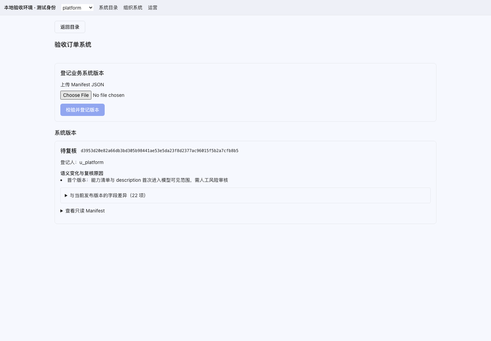
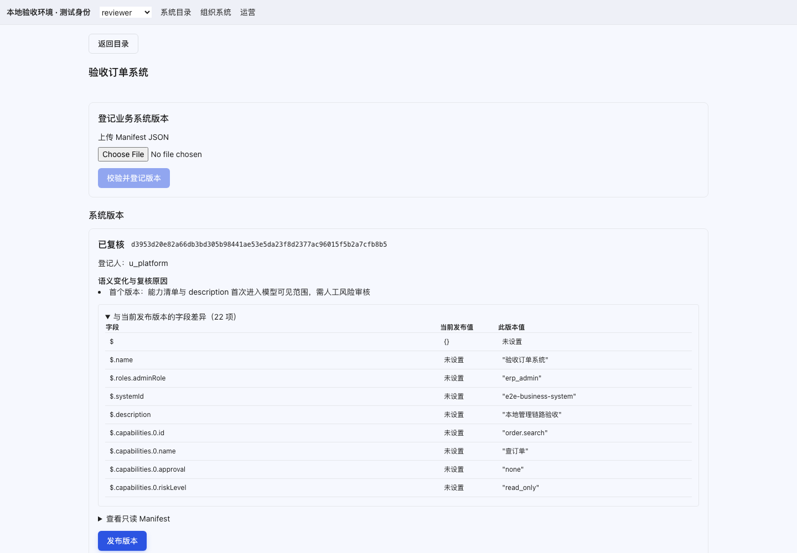
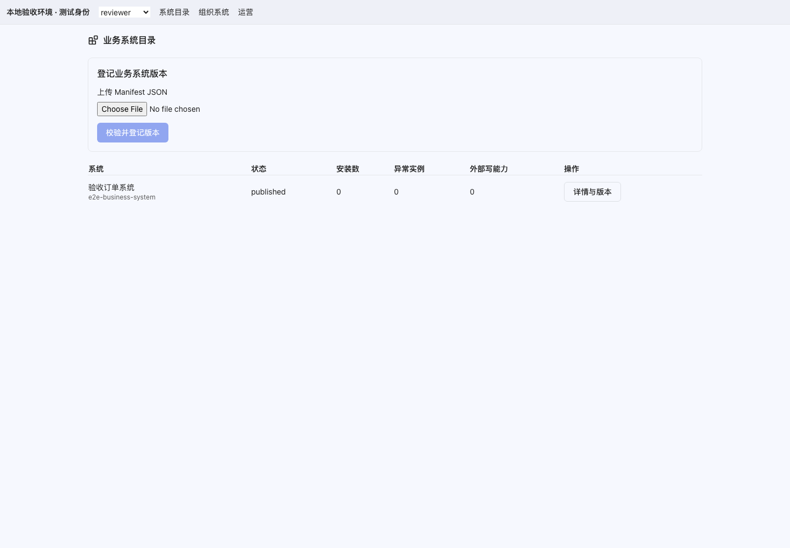
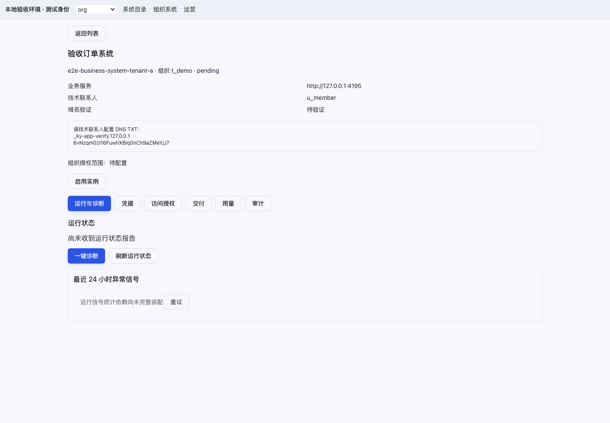
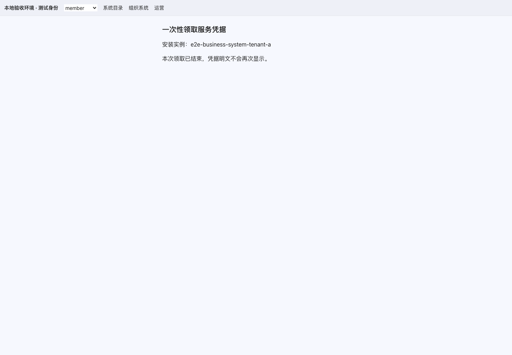

# 业务系统接入管理 P0 开发与验收记录

日期：2026-09-07。PR：[#548](https://github.com/ZengLeiPro/agent-saas/pull/548)，分支 `feat/business-systems-p0`。

P0 管理功能已实现，当前保持草稿 PR。完整业务验收尚未完成：需要可部署的测试业务系统、测试组织和技术联系人，继续执行实施文档第 10 节。以下结果均为本地隔离环境证据，不表示线上部署或真实业务验收通过。

## 开发范围

| 工作包 | 实现                                                                                                   |
| ------ | ------------------------------------------------------------------------------------------------------ |
| WP0    | 五个治理路由、管理导航、业务系统图标、API 客户端和错误合同                                             |
| WP1    | 平台系统详情、安装分页/筛选、组织权益、服务端 allowedActions、组织越权拒绝、integrated_system 资源目录 |
| WP2    | Manifest 上传校验、版本字段差异、双人复核、expectedVersion 发布与冲突刷新                              |
| WP3    | 交付创建、步骤状态、原请求恢复、waiting_external 指引、一次性凭据领取                                  |
| WP4    | 组织可安装目录、安装向导、DNS 指引、实例详情、复用签名批量预览的 Assignment 编辑                       |
| WP5    | 独立运营/用量入口、运行和异常、凭据轮换、ready/digest 升级门禁、计划后确认离场                         |
| WP6    | 成员端“业务系统”文案、组件/HTTP/PG 回归、壳浏览器测试、本地管理浏览器验收；外部完整验收待补            |

启用实例不会自动授权全员；已有授权在启停之间保留，删除清空。停用标签也只向原授权成员展示，工具快照继续拒绝停用资源。管理页不会显示服务凭据和安装密钥明文；仅登记的技术联系人可在专用页面确认领取一次。

## 已验证

- 全工作区 TypeScript 检查通过；Web 生产构建通过。
- Web 全量 351 个测试文件、2,566 项测试通过，管理壳和布局契约通过。
- 契约包 11 个测试文件、143 项测试通过。新增浏览器校验子入口保留原 Schema 与语义校验，UTF-8 字节计算兼容浏览器。
- PostgreSQL 管理查询：微秒游标分页、租户过滤、安装/风险汇总、凭据元数据、缺少事件表时异常筛选返回空。
- 真实 HTTP＋PostgreSQL：登记→复核→发布→组织权益→安装→领取→确认；另一组织 403，非技术联系人 403，重复领取 409，响应 no-store，管理元数据不含明文。
- 真实 PG 授权回读：首次启用空授权；U1 授权后可见，U2 不可见；启停再启用保留规则；停用资源不进入有效工具资源集合。
- 壳 Playwright：27 项通过，覆盖跨源握手、消息来源、重复消息、链接准入、续期和停用。
- 管理 Playwright：上传→双人复核→发布→组织安装→一次性领取通过。使用真实管理路由和 PG，身份通过测试头注入，生产登录流程未在此用例执行。

HTTP＋PG 用例为安装启用预置了 DNS 已验证事实，不能作为 DNS 归属验证证据。服务凭据确认通过真实平台 HTTP 完成，但尚未由实际业务系统装配发出。

## 页面证据

领取截图已清除明文。测试关闭 trace 和 video，未保存凭据明文、票据或安装密钥。

## 实施文档差异与待验收项

现有发布门禁要求**首个版本也经另一位管理员复核**。实施文档第 10.2 节“v1 发布无需人工复核”与此不符；本次保留现有服务端门禁，并以实际复核流程验收。

尚待外部测试环境完成：完整 onboard 至 completed；DNS TXT 真实解析；技术联系人向业务系统装配并确认；U1 握手与真实只读业务数据；U2 的 Agent 新会话工具快照拒绝；Assignment 人数预览截图；v2 外部部署与 registeredDigest 切换、回滚；诊断/用量/审计回读；轮换重叠期与离场执行。这些项目未标记为通过。

未修改 Workflow、未合并 PR、未部署线上。回滚可按 PR 内功能提交逆序 revert；没有新增数据库迁移。启停原授权规则保留是刻意改变，回滚到旧服务前需评估旧逻辑会清空精细授权的影响。

复现入口见 [本地管理验收说明](../e2e/ky-app-management/README.md)。
