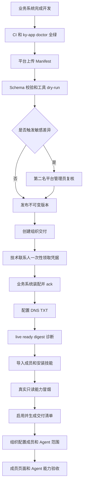

# KY Agent 业务系统接入管理最终产品形态

> 文档状态：产品目标态
>
> 适用范围：平台管理员、组织管理员、业务系统技术联系人、普通成员
>
> 核心目标：让业务系统从登记、复核、发布、组织安装、凭据交付、成员授权到运行监控，均可在 KY Agent 后台完成；终端仅保留开发自测和自动化能力。

## 1. 结论

业务系统应成为 KY Agent 的一等资源，而不是隐藏在“计费”“连接器”或其他无关页面中的附属信息。

最终产品必须提供三个清晰入口：

```text
平台配置 → 资源目录 → 业务系统
组织配置 → 构建 · 调用资产 → 业务系统
成员工作区 → 业务系统
```

同时提供两个分析入口：

```text
平台分析 → 业务系统运营
组织分析 → 业务系统用量
```

管理员日常操作不得依赖 `ky-app register`、`ky-app onboard` 等终端命令。CLI 继续作为开发者工具、批量交付和故障恢复备用入口。

## 2. 当前产品现状

### 2.1 当前确有前端入口，但位置隐蔽

当前代码中，KY App 交付健康面板位于：

```text
平台配置
→ 组织
→ 选择一个组织
→ 进入配置
→ 计费
```

这里能够查看交付健康、运行状态、能力、凭据元数据、异常信号和操作记录，并支持启用、停用和一键诊断。

平台左侧另有：

```text
平台分析 → 计费总表
```

但该入口只展示计费组件，并不展示 KY App 交付健康面板。因此，当前不存在名称明确、可以直接发现的“业务系统”管理入口。

### 2.2 当前已有能力

- 成员 PC 端左侧“定制软件”入口和跨源 iframe 宿主。
- 系统定义、不可变版本、安装实例、域名验证和凭据 API。
- SAT/JWKS、安装证明、组织目录快照与变更流。
- Capability Gateway、会话工具快照、写操作确认、限流和审计。
- 可恢复开箱、成员导入、技能安装、真实诊断和交付清单。
- 平台交付健康、组织用量、启停和一键诊断页面。

### 2.3 当前缺失的产品页面

- 系统目录和系统创建页面。
- Manifest 上传、校验和版本差异页面。
- 版本复核、发布和退役页面。
- 组织安装向导。
- 凭据一次性领取专用页面。
- DNS、live、ready、digest 的交付进度页面。
- 安装实例成员、部门和 Agent 授权页面。
- KY App 专用凭据轮换页面。
- 系统升级、回滚和离场页面。
- 个人 OAuth/Token 账号连接页面。

## 3. 产品目标

### 3.1 平台管理员

平台管理员能够：

- 创建和维护业务系统目录。
- 上传并校验 Manifest。
- 查看版本差异和安全影响。
- 完成双人复核并发布版本。
- 为组织发起系统交付。
- 查看所有安装实例的运行和使用情况。
- 管理凭据轮换、系统升级和离场。

### 3.2 组织管理员

组织管理员能够：

- 从平台目录安装系统。
- 查看本组织已接入系统。
- 配置展示、能力、组织凭据和授权范围。
- 分配成员、部门组和组织 Agent。
- 查看健康、用量、审计和凭据到期情况。
- 停用系统或发起离场申请。

### 3.3 技术联系人

技术联系人能够：

- 在登录后的一次性安全页面领取服务凭据和安装密钥。
- 查看待完成的 DNS、环境变量和健康检查事项。
- 确认业务系统已完成凭据装配。
- 查看诊断失败项和修复建议。

### 3.4 普通成员

普通成员能够：

- 在“业务系统”工作区查找和打开有权使用的系统。
- 在系统和 Agent 之间切换且不丢失页面状态。
- 将当前业务问题发送给 Agent。
- 在需要个人身份时连接或断开自己的系统账号。
- 只看到自身权限范围内的页面、数据和 Agent 能力。

## 4. 产品原则

### 4.1 页面接入与能力接入分离

一个系统允许是以下任意形态：

- 只有页面。
- 只有 Agent 能力。
- 同时具有页面和 Agent 能力。
- 先接页面，后续逐步增加能力。

页面故障不应自动关闭 API 能力；API 故障也不应自动阻止用户打开仍可用的页面。

### 4.2 新系统优先标准契约，已有系统支持低改造接入

- 新建系统默认使用 `create-ky-app`，按 KY App 契约接入。
- 其他技术栈可以自行实现契约，以 `ky-app doctor` 全绿作为准入标准。
- 已有系统可以只配置页面、MCP、OpenAPI 或 REST 能力。
- 浏览器自动化仅作为无 API 时的补充方案。

### 4.3 服务端绑定身份和凭据

模型只选择能力并产生 Schema 允许的业务参数。以下内容不得由模型控制：

- `tenantId`、`userId` 和外部账号 ID。
- Token、Cookie、Secret 和任意 Header。
- 完整 URL、Host、HTTP Method 和重试次数。

### 4.4 所有变更可追溯、可恢复

- 版本发布不可覆盖，修改必须产生新 digest。
- 敏感变更需要登记人与复核人分离。
- 开箱流程可以从外部等待点继续。
- 写操作参数必须与审批记录绑定。
- 删除、离场等高风险操作需要二次确认和审计回执。

## 5. 信息架构

### 5.1 平台配置

```text
平台配置
├─ 组织
├─ 资源目录
│  ├─ 模型
│  ├─ 技能
│  ├─ 连接器
│  └─ 业务系统              ← 新增一级页面
├─ 系统交付                  ← 新增一级页面
│  ├─ 进行中
│  ├─ 等待外部处理
│  ├─ 已完成
│  └─ 失败
└─ 访问控制
```

“业务系统”管理系统定义和版本；“系统交付”管理组织安装实例和开箱过程。两者不可合并到计费页面。

### 5.2 平台分析

```text
平台分析
├─ 平台总览
├─ 业务系统运营              ← 新增一级页面
│  ├─ 安装与活跃
│  ├─ 健康与异常
│  ├─ 能力调用
│  ├─ 凭据与到期
│  └─ 客户交付
├─ 计费总表
└─ 套餐额度
```

现有“交付客户健康度”从组织计费详情迁移到“业务系统运营”，计费页面只保留金额、积分和账单内容。

### 5.3 组织配置

```text
组织配置
└─ 构建 · 调用资产
   ├─ 智能体
   ├─ 技能
   ├─ 工作流
   ├─ 连接器
   └─ 业务系统                ← 新增一级页面
      ├─ 已安装
      ├─ 可安装
      ├─ 待处理
      └─ 已停用
```

“连接器”继续管理通用 Connector/MCP 和组织共享凭据；“业务系统”管理系统安装实例。两者允许互相引用，但不能混为同一个资源。

### 5.4 组织分析

```text
组织分析
├─ 组织总览
├─ 用量与成本
└─ 业务系统用量              ← 新增页签或独立页面
```

### 5.5 成员端

```text
左侧工作区
├─ 开沿 Agent
└─ 业务系统
   ├─ 搜索
   ├─ 收藏
   ├─ 最近使用
   ├─ 系统分组
   └─ 系统列表
```

对用户统一使用“业务系统”称谓；“定制软件”保留为历史兼容文案，不再作为新页面主名称。

## 6. 角色与权限

| 操作                  | 平台管理员                 | 组织管理员         | 技术联系人           | 普通成员       |
| --------------------- | -------------------------- | ------------------ | -------------------- | -------------- |
| 创建系统定义          | 允许                       | 不允许             | 不允许               | 不允许         |
| 登记系统版本          | 允许                       | 不允许             | 可提交材料，不可发布 | 不允许         |
| 复核和发布版本        | 允许，且复核人与登记人分离 | 不允许             | 不允许               | 不允许         |
| 创建组织安装实例      | 允许                       | 允许安装已授权系统 | 不允许               | 不允许         |
| 领取安装凭据          | 不读取明文                 | 不读取明文         | 仅本人一次性领取     | 不允许         |
| 配置成员和 Agent 范围 | 可代管                     | 允许               | 不允许               | 不允许         |
| 配置组织共享凭据      | 可代管                     | 允许               | 可协助装配           | 不允许         |
| 连接个人账号          | 不代替成员操作             | 不代替成员操作     | 仅自己的账号         | 仅自己的账号   |
| 查看运行状态          | 全部                       | 本组织             | 负责的安装实例       | 只看客户面状态 |
| 启用/停用             | 全部                       | 本组织允许范围     | 不允许               | 不允许         |
| 执行离场              | 二次确认后允许             | 只能申请或停用     | 不允许               | 不允许         |

所有读取和写入都必须由服务端重新判断权限。隐藏按钮不能代替后端授权。

## 7. 核心资源与状态

### 7.1 系统定义

```text
draft → published → disabled → retired
```

- `draft`：尚不可安装。
- `published`：允许在授权组织中安装。
- `disabled`：阻止新安装，已有实例按策略提示不可用。
- `retired`：终态，不允许恢复。

### 7.2 系统版本

```text
registered → pending_review → reviewed → published
```

无敏感差异时可以从 `registered` 直接进入 `published`；涉及能力、路径、风险或鉴权变化时必须进入双人复核。

### 7.3 安装实例

```text
pending → enabled ↔ disabled → deleted
```

- `pending`：等待凭据、DNS 或健康检查。
- `enabled`：成员可见，Agent 可按权限获得工具。
- `disabled`：保留记录和入口提示，不发放访问令牌。
- `deleted`：吸收终态，只能通过重新安装创建新实例。

### 7.4 交付执行

```text
running → waiting_external → running → completed
   └──────────────────────────────→ failed
```

外部等待包括：

- 版本需要复核。
- 技术联系人尚未领取或确认凭据。
- DNS TXT 尚未生效。
- ready 尚未成功或 digest 不一致。
- 租户技能尚未安装。
- 真实诊断未通过。

### 7.5 个人账号连接

```text
not_connected → connected → expired/revoked
```

未连接、已过期、已撤销或 scope 不足时，要求个人身份的能力不得暴露给 Agent。

## 8. 平台“业务系统”页面

### 8.1 系统目录列表

列表字段：

- 系统名称、图标和 `systemId`。
- 当前发布版本和 digest 前缀。
- 系统状态。
- 能力数量和风险概况。
- 已安装组织数、启用实例数和异常实例数。
- 最近发布时间和操作人。

筛选条件：

- 状态。
- 是否包含写能力。
- 是否要求个人授权。
- 接入方式：KY App、MCP、OpenAPI、REST、页面或浏览器。
- 是否存在健康异常或待复核版本。

主要操作：

- 新建系统。
- 上传 Manifest。
- 查看系统详情。
- 发起交付。
- 停用或退役。

### 8.2 新建系统向导

```text
第 1 步：基本信息
第 2 步：页面接入
第 3 步：能力接入
第 4 步：身份与凭据
第 5 步：风险与审批
第 6 步：诊断与预览
第 7 步：登记版本
```

支持两种入口：

1. 上传标准 `ky-app.manifest.json`。
2. 在后台表单中配置页面、MCP、OpenAPI 或 REST，平台生成 Manifest 草稿。

上传后立即展示：

- Schema 校验结果。
- 规范化后的能力名称。
- 工具名冲突。
- 域名与路径风险。
- 读写风险分布。
- 凭据和个人授权要求。
- 与当前发布版本的差异。

### 8.3 系统详情

页签：

```text
概览 | 版本 | 页面 | 能力 | 安装组织 | 运行健康 | 操作记录
```

“能力”页签仅编辑草稿版本；已发布版本始终只读。

### 8.4 版本复核与发布

复核页必须显示：

- 新旧 Manifest digest。
- 菜单和路径前缀变化。
- 新增、删除和修改的能力。
- 风险等级变化。
- `safeToRetry`、审批要求和超时变化。
- 外链白名单变化。
- 所需技能变化。
- 受影响安装组织和会话工具快照。

发布按钮只有在以下条件满足时可用：

- Manifest 校验通过。
- 工具注册 dry-run 通过。
- 敏感差异已经由另一名管理员复核。
- 当前系统定义版本与预览基线一致。

## 9. 平台“系统交付”页面

### 9.1 交付列表

按状态分组：

- 进行中。
- 等待外部处理。
- 已完成。
- 失败。

列表展示：

- 组织、系统和安装实例。
- 当前步骤。
- 阻断原因。
- 当前负责人。
- 最近更新时间。
- 凭据领取截止和确认截止。

### 9.2 新建交付向导

```text
1. 选择已发布系统版本
2. 选择已有组织或创建组织
3. 设置首个组织管理员
4. 设置技术联系人
5. 配置安装域名和 origin
6. 上传成员 CSV
7. 设置首次赠送积分
8. 确认并启动交付
```

启动后显示九步进度：

```text
组织与管理员
→ 积分
→ 系统版本
→ 安装实例与凭据
→ DNS、ready 与启用
→ 成员导入
→ 技能安装
→ 真实冒烟
→ 交付清单
```

### 9.3 可恢复交付

当状态为 `waiting_external` 时，页面必须展示：

- 为什么暂停。
- 谁需要处理。
- 精确操作说明。
- 验证按钮。
- 外部条件完成后的“继续交付”按钮。

后台复用相同请求摘要继续执行，不得重复赠送积分、重复创建组织或重复签发有效凭据。

## 10. 技术联系人凭据领取页面

页面地址使用一次性票据，但必须先完成登录。

页面流程：

```text
验证当前用户是技术联系人
→ 展示领取风险提示
→ 再次确认
→ 一次性显示服务凭据和安装密钥
→ 引导立即保存到业务系统密钥管理
→ 标记页面不可再次打开
→ 等待业务系统 credential-ack
```

显示字段：

- `KY_SERVICE_CREDENTIAL`。
- `KY_INSTALLATION_KEY`。
- `KY_INSTALLATION_KEY_VERSION`。
- 过期时间和确认截止时间。
- 复制按钮和下载一次性 `.env` 片段按钮。

安全要求：

- `Cache-Control: no-store`。
- 页面不写浏览器存储。
- 切换页面后不再展示明文。
- 不允许平台管理员代领。
- 不在操作审计中记录明文或摘要片段。
- 下载文件需要明确风险确认，文件名不得包含真实凭据。

## 11. 组织“业务系统”页面

### 11.1 已安装列表

展示：

- 系统名称、图标和安装状态。
- 当前版本和可升级版本。
- 页面状态、能力状态和账号连接状态。
- 已授权成员、部门组和 Agent 数量。
- 最近使用和最近异常。

### 11.2 安装系统

组织管理员从平台已发布且权益允许的系统目录中选择安装。

安装向导：

```text
选择系统
→ 配置组织访问地址
→ 选择页面打开方式
→ 配置组织共享凭据或个人授权方案
→ 选择启用能力
→ 配置成员范围
→ 配置 Agent 范围
→ 诊断
→ 启用
```

组织管理员不得修改平台定义的能力风险等级，也不得把要求个人身份的能力改成组织共享身份。

### 11.3 安装实例详情

页签：

```text
基本信息
展示方式
系统能力
凭据与授权
成员范围
Agent 范围
运行状态
用量
操作记录
```

### 11.4 成员和 Agent 授权

成员范围支持：

- 全体成员。
- 指定部门组。
- 指定成员。

Agent 范围支持：

- 个人 Agent。
- 指定组织 Agent。
- Agent 内具体能力白名单。

保存前展示权威影响预览，明确新增和失去访问权的成员、部门和 Agent 数量。

## 12. 成员“业务系统”工作区

### 12.1 系统列表

提供：

- 搜索。
- 系统分组。
- 收藏。
- 最近使用。
- 可用状态。
- 待连接账号提醒。

没有任何可用系统时，不显示空工作区入口。

### 12.2 系统宿主

支持：

- `iframe`：右侧嵌入。
- `external`：展示系统介绍和“打开系统”。
- `auto`：优先 iframe，不兼容时引导新窗口。
- `native`：未来原生集成页面。

切回 Agent 后保留系统页面和滚动状态；切回系统时恢复原路径。

### 12.3 Agent 联动

系统可以请求：

- 打开 Agent 并预填问题。
- 将当前单据的安全摘要传给 Agent。
- 显示操作结果链接。

不得把页面 Cookie、Token、整页 HTML 或未经声明的数据直接发送给模型。

## 13. 个人账号连接

当能力要求 `user_oauth` 或 `user_token` 时，组织分配系统后，成员在：

```text
个人设置 → 连接与授权
```

看到“组织提供”的系统连接卡。

连接卡状态：

```text
待连接 | 已连接 | 即将过期 | 已过期 | 已撤销 | 权限不足
```

支持：

- OAuth Authorization Code + PKCE。
- 个人 Token 一次性录入。
- 重新授权。
- 主动断开。
- 查看授权 scope 和最近使用时间。

Secret 永不回显。未连接或连接失效时，相关能力不得出现在 Agent 工具面中。

## 14. 平台“业务系统运营”页面

### 14.1 总览指标

- 系统定义数、已发布数和待复核数。
- 安装组织数、启用实例数和异常实例数。
- 日活成员、周活成员和使用渗透率。
- 能力调用次数、成功率和 P95 耗时。
- 写操作确认率和未知结果数。
- 凭据即将到期数。
- DNS、live、ready、digest 异常数。

### 14.2 健康列表

从当前“交付客户健康度”迁移并扩展，支持按系统、组织、状态和错误类型筛选。

安装实例详情展示：

- 基本信息和技术联系人。
- live/ready/digest。
- 版本和升级状态。
- 凭据状态和到期时间。
- 能力清单及风险等级。
- 限流、熔断和未知结果。
- 一键诊断结果。
- 最近操作记录。

### 14.3 操作

- 一键诊断。
- 启用或停用。
- 发起凭据轮换。
- 发起版本升级。
- 创建离场计划。
- 跳转至对应系统、组织或交付记录。

## 15. 端到端业务流程

### 15.1 新建 KY App 标准接入



### 15.2 已有系统低改造接入

```text
选择接入层级
→ 配置页面 URL
→ 导入 MCP/OpenAPI 或配置 REST
→ 选择身份和凭据模式
→ 设置风险等级
→ 真实诊断
→ 发布系统版本
→ 组织安装和授权
```

### 15.3 系统版本升级

```text
登记新版本
→ 展示差异和影响组织
→ 必要时双人复核
→ 发布新版本
→ 选择试点安装实例
→ ready/digest 验证
→ 切换 registeredDigest
→ 分批升级
→ 观察健康和业务结果
```

失败时回到旧 `registeredDigest`；不得覆盖或修改已发布版本内容。

### 15.4 系统离场

```text
创建离场计划
→ 展示影响成员、Agent、凭据和审计保留策略
→ 二次确认安装实例 ID
→ 停用安装实例
→ 吊销服务凭据
→ 停止签发 SAT
→ 保留审计和交付记录
→ 业务系统完成自身数据处理
→ 标记离场完成
```

平台不得替业务系统删除其业务数据。

## 16. 后台页面与现有 API 映射

| 后台能力       | 现有服务端接口或能力                                                  | 页面现状       |
| -------------- | --------------------------------------------------------------------- | -------------- |
| 系统目录       | `GET /api/app-contract/v1/systems`                                    | 缺失           |
| 登记版本       | `POST /systems/:systemId/versions`                                    | 缺失           |
| 复核版本       | `POST /systems/:systemId/versions/:digest/review`                     | 缺失           |
| 发布版本       | `POST /systems/:systemId/versions/:digest/publish`                    | 缺失           |
| 创建安装实例   | `POST /installations`                                                 | 缺失           |
| 域名验证       | `POST /installations/:iid/verify-domain`                              | 缺失           |
| 凭据签发和领取 | `/installations/:iid/credentials/*`                                   | 缺失专用页面   |
| 可恢复开箱     | `POST /onboard`、`GET /onboard/:executionId`                          | 缺失           |
| 运行状态       | `GET /installations/:iid/runtime`                                     | 已有           |
| 一键诊断       | `POST /installations/:iid/diagnose`                                   | 已有           |
| 凭据元数据     | `GET /installations/:iid/credentials`                                 | 已有只读展示   |
| 操作记录       | `GET /installations/:iid/audit`                                       | 已有           |
| 异常信号       | `GET /installations/:iid/signals`                                     | 已有           |
| 启用/停用      | `POST /installations/:iid/enable`、`POST /installations/:iid/disable` | 已有平台页面   |
| 平台交付健康   | `GET /deliveries/health`                                              | 已有但入口错误 |
| 组织用量       | `GET /usage?tenantId=...`                                             | 已有           |
| 离场计划和执行 | `/installations/:iid/offboarding*`                                    | 缺失           |

前端建设应优先复用这些已经存在的 API，不应在浏览器重新实现开箱状态机、权限判断或凭据生命周期。

## 17. 安全与治理要求

### 17.1 租户隔离

- 所有系统安装实例必须绑定唯一 `tenantId`。
- 平台管理员跨组织操作必须显式选择目标组织。
- 组织管理员只能操作本组织安装实例。
- 列表、详情、诊断、启停和凭据接口均需服务端校验目标组织。
- 未授权资源统一按防枚举策略返回。

### 17.2 凭据

- 明文只进入 SecretVault 或一次性领取响应。
- 数据库只保存摘要、状态和 Secret 引用。
- 前端只显示是否配置、到期时间和代次。
- 轮换采用“签发新凭据 → 业务系统确认 → 撤销旧凭据”。

### 17.3 风险与审批

- `read_only` 不得产生业务副作用。
- `external_write` 默认必须确认。
- 审批绑定当前用户、组织、安装实例、能力、会话、逻辑调用和参数摘要。
- 写请求超时后查询执行状态，不自动重发。

### 17.4 发布

- 已发布版本只读。
- 高风险差异必须双人复核。
- 发布前必须做工具注册 dry-run。
- 系统升级必须先验证 ready digest。

## 18. 错误与恢复体验

页面不得只显示技术错误码，应给出负责人和下一步动作。

| 场景           | 客户面提示                   | 管理员操作                  |
| -------------- | ---------------------------- | --------------------------- |
| 凭据未领取     | 等待技术联系人领取           | 复制领取入口、重新签发      |
| 凭据未确认     | 系统尚未完成凭据装配         | 查看截止时间、重新检测      |
| DNS 未生效     | 域名归属尚未验证             | 展示 TXT 名称和值、重新检测 |
| ready 失败     | 系统尚未准备完成             | 展示分项诊断                |
| digest 不一致  | 系统版本与登记版本不一致     | 重新部署或发起升级          |
| `/me` 失败     | 暂时无法取得当前用户权限     | 重试并查看业务系统日志      |
| 个人账号未连接 | 请先连接系统账号             | 跳转“连接与授权”            |
| 写操作结果未知 | 操作可能已执行，正在确认结果 | 查看逻辑调用和执行状态      |

## 19. 验收标准

### 19.1 平台管理

- 平台管理员无需终端即可创建、登记、复核、发布和退役系统。
- 敏感版本必须由第二名管理员复核。
- 能从系统详情下钻到所有组织安装实例。
- 可以在独立“业务系统运营”页面查看健康和异常。

### 19.2 组织安装

- 组织管理员无需手填内部 ID 即可安装已授权系统。
- 成员、部门组和 Agent 均通过目录选择。
- 凭据明文不会展示给组织管理员。
- 停用后下一次运行不再向 Agent 暴露能力。

### 19.3 交付

- 开箱中断后可以在后台继续。
- 重复继续不会重复赠送积分、创建组织或签发有效凭据。
- DNS、凭据、ready、digest 和真实能力均有独立状态。
- 只有真实只读调用成功后才能标记交付完成。

### 19.4 成员体验

- 有权成员能够看到并打开系统。
- 无权成员不能通过直接 URL 访问安装实例。
- 系统和 Agent 之间切换不丢失状态。
- Agent 只获得当前用户和当前 Agent 有权使用的能力。

### 19.5 业务安全

- 用户 A 和用户 B 的查询结果符合各自业务系统权限。
- 伪造 `userId`、`tenantId` 或外部账号 ID 不改变服务端身份。
- 写操作未经批准不执行，批准后最多执行一次。
- Secret 不进入前端响应、Prompt、Tool Schema、日志和审计元数据。

## 20. 分阶段交付建议

### P0：补齐当前 KY App 后台闭环

- 平台“业务系统”目录和详情。
- Manifest 上传、校验、复核和发布。
- 平台“系统交付”向导和继续交付。
- 技术联系人一次性凭据领取页。
- 组织“业务系统”列表、实例详情和 Assignment。
- 将现有交付健康面板迁移到“业务系统运营”。
- 凭据轮换、升级和离场页面。

P0 完成后，标准 KY App 的管理员操作不再依赖终端。

### P1：低改造系统接入

- 仅 URL 页面接入。
- iframe、新窗口和自动降级配置。
- MCP 能力绑定。
- 手动 REST 能力配置。
- 组织共享凭据。

### P2：个人身份和 OpenAPI

- OAuth Authorization Code + PKCE。
- 个人 Token 连接。
- 连接卡和过期/撤销状态。
- OpenAPI 导入、operation 选择和 Schema 生成。

### P3：浏览器和页面上下文增强

- 受控浏览器操作能力。
- 页面当前单据安全摘要。
- 多 iframe LRU 保持。
- 移动端 WebView 或外部浏览器策略。

## 21. CLI 的最终定位

保留以下命令：

- `create-ky-app`：新系统脚手架。
- `ky-app doctor`：开发和 CI 契约验证。
- `ky-app register`：自动化登记备用入口。
- `ky-app onboard`：批量交付和灾备入口。
- `ky-app rotate-credential`：紧急轮换备用入口。

后台和 CLI 必须调用同一组服务端 API，并产生相同的治理审计。后台不是另一套业务逻辑，CLI 也不能绕过复核、租户隔离、凭据领取和写操作审批。

## 22. 最终决策

1. 后台新增明确的“业务系统”一级入口，不再依赖“计费”页发现 KY App。
2. 系统定义/版本与组织安装实例分层管理。
3. 平台配置负责目录、发布和交付；组织配置负责安装、授权和凭据；分析页面只负责观测。
4. 新系统默认使用 KY App 标准契约，已有系统允许页面、MCP、OpenAPI 和 REST 低改造接入。
5. 管理员全部日常操作页面化，CLI 只服务开发、批量自动化和故障恢复。
6. 完成标准以真实页面、身份、权限和业务能力验收为准，不以接口存在、HTTP 200 或健康检查替代。
